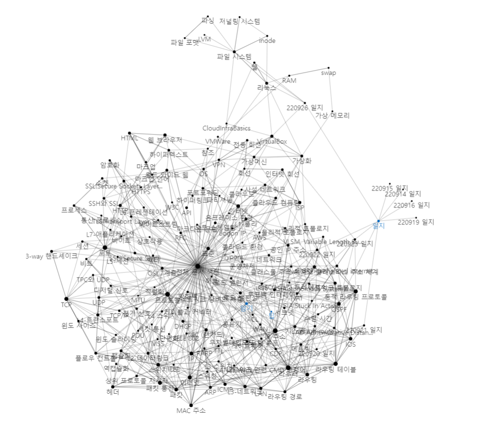

# [CloudInfraBasics](https://shavingmace.github.io/CloudInfraBasics/)

 
주로 클라우드 인프라 엔지니어링과 관련한 지식을 VisualS Studio Code의 확장 중 하나인 [foam](https://foambubble.github.io/foam/)에서 제공하는 위키 형태로 기록하는 문서입니다. 

## 오늘의 문서 
- [[파일 시스템]]
- [[쉘]]
- [[리눅스]]
- [[표준 입출력]]

## **>>[[전체 문서 색인]]<<**

## 저자 정보

### author: shavingmace
### contact: pskyd0151@gmail.com
### 마지막 업데이트: 2022-09-23, 143개 문서

[//begin]: # "Autogenerated link references for markdown compatibility"
[파일 시스템]: <docs/파일 시스템.md> "파일 시스템"
[쉘]: docs/쉘.md "쉘"
[리눅스]: docs/리눅스.md "리눅스"
[표준 입출력]: <docs/표준 입출력.md> "표준 입출력(I/O)"
[전체 문서 색인]: <docs/전체 문서 색인.md> "전체 문서 색인"
[//end]: # "Autogenerated link references"