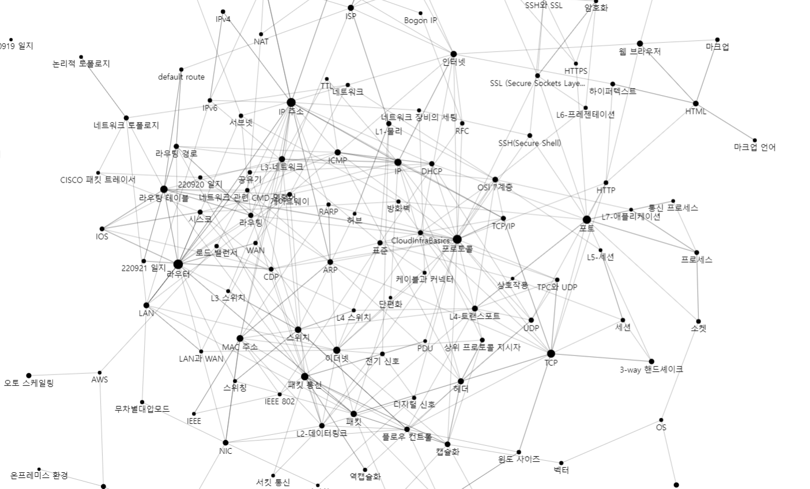

# [CloudInfraBasics](https://shavingmace.github.io/CloudInfraBasics/)

주로 클라우드 인프라 엔지니어링과 관련한 지식을 VisualS Studio Code의 확장 중 하나인 [foam](https://foambubble.github.io/foam/)에서 제공하는 위키 형태로 기록하는 문서입니다. 

### author: shavingmace
### contact: pskyd0151@gmail.com
### 마지막 업데이트: 2022-09-20

## 문서 네트워크 시각화

## 오늘의 문서 
- [[CDP]]
- [[라우팅 테이블]]

## 추천 문서
### 네트워크 이론 
- [[OSI 7계층]], [[프로토콜]]
- [[TCP]], [[TCP와 UDP]], [[TCP-IP]]
- [[이더넷]], [[인터넷]]

[//begin]: # "Autogenerated link references for markdown compatibility"
[CDP]: docs/CDP.md "CDP"
[라우팅 테이블]: <docs/라우팅 테이블.md> "라우팅 테이블"
[OSI 7계층]: <docs/OSI 7계층.md> "OSI 7계층"
[프로토콜]: docs/프로토콜.md "프로토콜"
[TCP]: docs/TCP.md "TCP"
[TCP와 UDP]: <docs/TCP와 UDP.md> "TPC와 UDP"
[TCP-IP]: docs/TCP-IP.md "TCP/IP"
[이더넷]: docs/이더넷.md "이더넷"
[인터넷]: docs/인터넷.md "인터넷"
[//end]: # "Autogenerated link references"
[//begin]: # "Autogenerated link references for markdown compatibility"
[CDP]: docs/CDP.md "CDP"
[라우팅 테이블]: <docs/라우팅 테이블.md> "라우팅 테이블"
[OSI 7계층]: <docs/OSI 7계층.md> "OSI 7계층"
[프로토콜]: docs/프로토콜.md "프로토콜"
[TCP]: docs/TCP.md "TCP"
[TCP와 UDP]: <docs/TCP와 UDP.md> "TPC와 UDP"
[TCP-IP]: docs/TCP-IP.md "TCP/IP"
[이더넷]: docs/이더넷.md "이더넷"
[인터넷]: docs/인터넷.md "인터넷"
[//end]: # "Autogenerated link references"