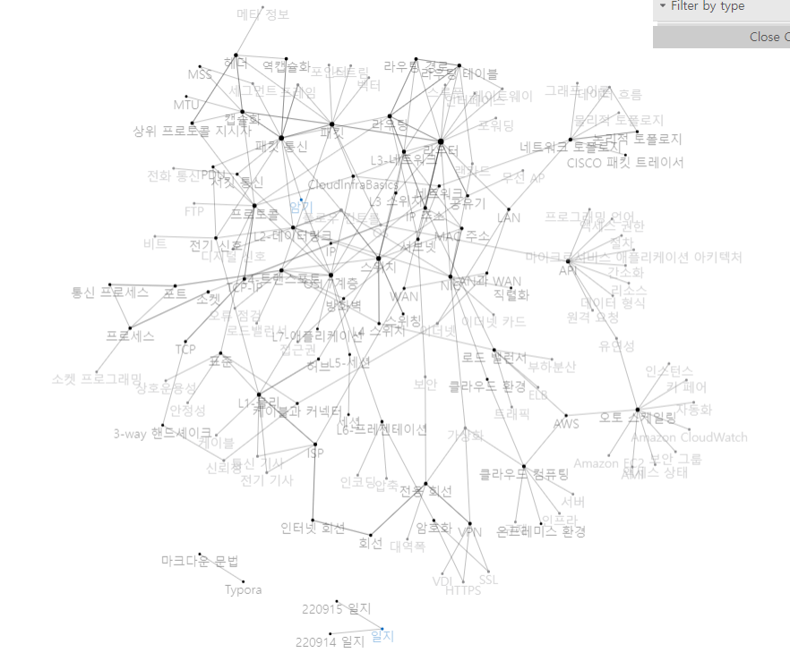

# CloudInfraBasics

CCCR MLOps 과정에서 배운 지식을 VisualS Studio Code의 확장 중 하나인 [foam](https://foambubble.github.io/foam/)에서 제공하는 위키 형태로 기록하는 문서입니다. 
# 

## 문서 네트워크 시각화

# 

## 추천 문서
- [[OSI 7계층]]
- [[라우터]]
- [[패킷 통신]]
- [[NIC]]
- [[프로토콜]]

[//begin]: # "Autogenerated link references for markdown compatibility"
[OSI 7계층]: <docs/OSI 7계층> "OSI 7계층"
[라우터]: docs/라우터 "라우터"
[패킷 통신]: <docs/패킷 통신> "패킷 통신"
[NIC]: docs/NIC "NIC"
[프로토콜]: docs/프로토콜 "프로토콜"
[//end]: # "Autogenerated link references"