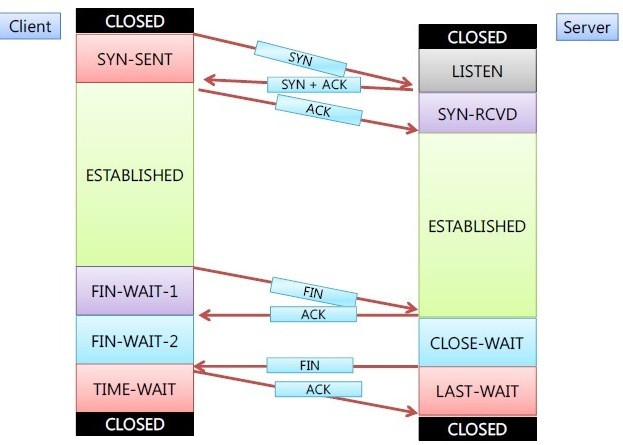
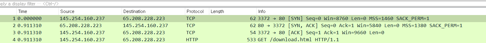
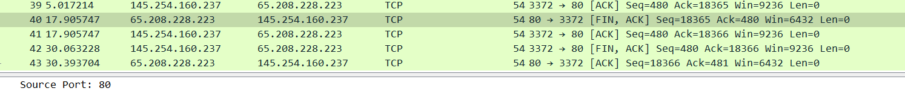

# 3-way 핸드셰이크

[[TCP]]에서 두 컴퓨터가 연결이 확립되기 위해 필요한 확인 응답 절차.

느리지만 견고한 [[신뢰성]]을 목적으로 한다.

[[3-way 핸드셰이크]]로 연결을 수립하고 4-way 핸드셰이크로 연결을 종료한다. 

SYN을 보내는 쪽이 무조건 클라이언트다.

그림1: 와이어샤크에서 3-way 핸드셰이크의 예
SYN-> SYN, ACK -> ACK

그림2: 와이어샤크에서 4-way 핸드셰이크의 예
FIN, ACK -> ACK -> FIN, ACK -> ACK

[//begin]: # "Autogenerated link references for markdown compatibility"
[TCP]: TCP.md "TCP"
[3-way 핸드셰이크]: <3-way 핸드셰이크.md> "3-way 핸드셰이크"
[//end]: # "Autogenerated link references"