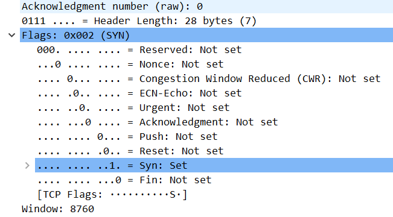
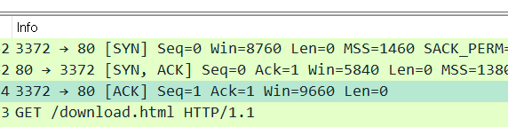

# 3-way 핸드셰이크

[[TCP]]에서 두 컴퓨터가 연결이 확립되기 위해 필요한 확인 응답 절차.
느리지만 견고한 [[신뢰성]]을 목적으로 한다.

[[3-way 핸드셰이크]]로 연결을 수립하고 4-way 핸드셰이크로 연결을 종료한다. 
SYN을 보내는 쪽이 무조건 클라이언트다.

## 핸드셰이크에서 플래그

위 그림에서 볼 수 있듯 서로의 [[포트]]가 연결된 상태, [[세션]]의 수립 상태를 established라고 한다. 
[[3-way 핸드셰이크]]로 연결을 수립하고 4-way 핸드셰이크로 연결을 종료한다. 4-way 핸드셰이크로 통신을 끊는 것이 정상 종료이다. 

SYN 플래그가 올라가 있는 예.
플래그를 올리고 내리는 것으로 신호를 주고 받으면서 통신 상태를 확인한다. 

프롬프트에서 established된 포트들의 내역 확인하기(netstat -an으로 확인 가능)

### seq, ack의 통신 방법
1. 보내는 쪽이 임의 숫자로 자신의 seq를 생성(raw seq 숫자는 따로 있지만 [[와이어샤크]]는 사람이 해석하기 쉽게 0으로 초기화해준다.)
2. 데이터 송신후 자신의 seq 값에 보낸 데이터의 양만큼의 숫자를 증가시킴
3. 받는 쪽에서 전송 받은 seq와 데이터 양을 확인하고 ack 값을 계산해 응답으로 보냄
4. ack는 전송 받은 데이터의 양을 표시

- 

## [[와이어샤크]] 그림과 예들

그림1: 와이어샤크에서 3-way 핸드셰이크의 예
SYN-> SYN, ACK -> ACK

그림2: 와이어샤크에서 4-way 핸드셰이크의 예
FIN, ACK -> ACK -> FIN, ACK -> ACK

그림3: 와이어샤크에서 3-way 핸드셰이크에서 syn, ack 값의 변화
syn과 ack 값이 1씩 증가하는 것을 확인할 수 있다. 
항상 상대값은 0, 1, 1로 교환된다!

그림4: 갑자기 next sequence number가 480인 이유 - 이 숫자는 seq 숫자 + 지금 보낸 data 크기로 계산해야 한다. 
next sequence number보다 작은 크기의 ack가 오면 제대로 오지 않은 것이므로 다시 요청한다  
ACK와 next seq number는 항상 동일하다. 

[//begin]: # "Autogenerated link references for markdown compatibility"
[TCP]: TCP.md "TCP"
[3-way 핸드셰이크]: <3-way 핸드셰이크.md> "3-way 핸드셰이크"
[포트]: 포트.md "포트"
[세션]: 세션.md "세션"
[3-way 핸드셰이크]: <3-way 핸드셰이크.md> "3-way 핸드셰이크"
[//end]: # "Autogenerated link references"