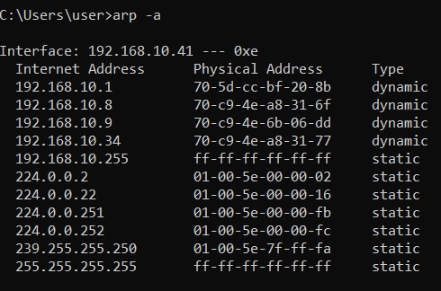
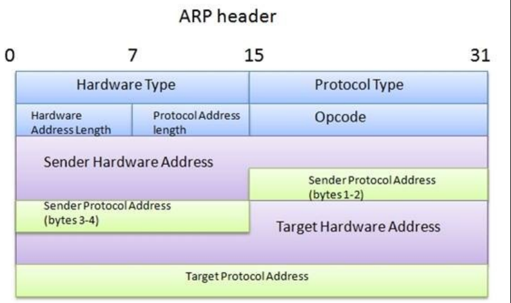

# ARP

[[IP 주소]]에 해당하는 [[MAC 주소]]를 알아오는 [[프로토콜]].

OSI 기준 2.6 계층 정도에서 작동하며 주로 [[이더넷]]과 [[TCP]] 사이에서 논리적 주소와 물리적 주소를 연결해주는 프로토콜이다. 

프로토콜 자체의 한계로 인해 매우 유명한 해킹 기법으로 arp spoofing이 있다.  

한편 GARP(Gratuitous ARP)는 대상 주소를 자신의 IP 주소로 하여 ARP 요청을 보내는 것으로 네트워크 상에 IP 주소의 충돌이 일어나고 있는지 확인하는 요청이다. 상대방에게 내 MAC 주소를 뿌릴 때 쓸 수 있다. 

## 원리
1. 대상을 찾기 위해 [[IP 주소]]에 해당하는 [[MAC 주소]]를 ARP로 요청 - 브로드캐스트
2. 해당 IP를 가진 호스트는 ARP 요청을 전송한 호스트에게 ARP 응답을 전송 - 유니캐스트

윈도 cmd에서는 arp -a 명령어로 로컬 네트워크 전체에 ARP 요청을 하고 MAC 주소를 확인할 수 있다. 

## ARP [[헤더]]

- 하드웨어 타입: 2계층 프로토콜 타입, 주로 1(Ethernet)
- 프로토콜 타입: 3계층 프로토콜 타입, 주로 0800(IPv4)
- 하드웨어 주소 길이: MAC 주소의 길이, 주로 6.
- 프로토콜 주소 길이: IP 주소의 길이, 주로 4.

OPCODE:
1. ARP 요청
2. ARP 응답
(위 두 가지를 알아두면 된다.)
3. [[RARP]] 요청
4. RARP 응답
5번 부터는 다른 종류의 요청과 응답

[//begin]: # "Autogenerated link references for markdown compatibility"
[IP 주소]: <IP 주소.md> "IP 주소"
[MAC 주소]: <MAC 주소.md> "MAC 주소"
[프로토콜]: 프로토콜.md "프로토콜"
[이더넷]: 이더넷.md "이더넷"
[TCP]: TCP.md "TCP"
[헤더]: 헤더.md "헤더"
[RARP]: RARP.md "RARP"
[//end]: # "Autogenerated link references"