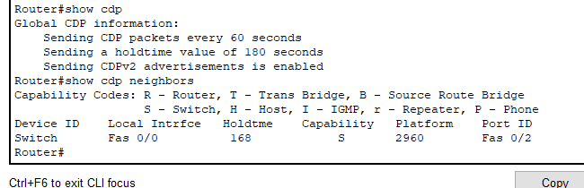
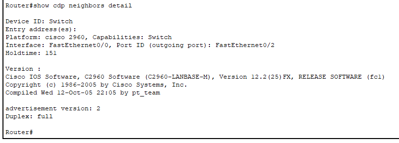

# CDP

[[시스코]] 장비 전용의 [[L2-데이터링크]] [[프로토콜]]

60초마다 패킷을 교환해 인접한 시스코 장비의 운영체제나 [[IP 주소]] 등 정보를 서로 공유한다. 이렇게 공유한 정보는 180초 동안 장비에 저장한다. 

관리자 입장에서는 장비 정보수집과 문제해결에 도움이 된다. 그러나 60초마다 데이터를 주므로 보안을 취약하게 만드는 정보를 주기적으로 노출하게 되기도 한다. 

## CDP의 활성화와 비활성화, 상태 확인

전역 구성 모드의 [[IOS]] 터미널에서 no cdp run 명령어로 cdp를 비활성화 할 수 있다.

개별 인터페이스 구성모드에서 no cdp enable 명령어로 특정 인터페이스의 cdp를 비활성화 할 수도 있다. 

show cdp로 cdp의 활성 상태를 확인할 수 있다. 

cdp를 다시 활성화 시키고 확인한 경우.

이웃에서 보낸 cdp를 확인할 때는 show cdp neighbors 명령어를 사용한다.

더 자세히 확인할 때는 show cdp neighbos detail.
어느 장비가 어떤 포트로 연결되어 있는지를 확인 가능하다. 

[//begin]: # "Autogenerated link references for markdown compatibility"
[시스코]: 시스코.md "시스코"
[L2-데이터링크]: L2-데이터링크.md "L2-데이터링크"
[프로토콜]: 프로토콜.md "프로토콜"
[IP 주소]: <IP 주소.md> "IP 주소"
[IOS]: IOS.md "IOS"
[//end]: # "Autogenerated link references"