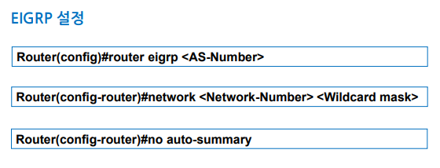

# EIGRPP(enhanced internet gateway routing protocol)
- IGRP를 개선한 [[시스코]]사 독점 [[동적 라우팅 프로토콜]]. 
- 수렴 시간이 빠른 편이며 성능이 높지만 다른 제조사 장비와 공유할 수 없다. 또 트래픽이 많이 발생하며 장비 리소스 사용량이 많다. 
- 중대형 규모 이상의 네트워크에서는 사용이 어렵다. ([[SIA]] 현상이 발생 가능하다.)
- IGP와 EGP 모두 사용 가능하다. 그러나 IGP 사용이 다수다.
- 자동 요약(auto-summary)이 기본으로 설정되어 있다. 초보자는 안 쓰는 것이 좋다. 
- Diffusing Update Algorithm(DUAL)을 사용해 최적 경로(successor)와 후속 경로(feasible successor)를 선출한다 - best path에 이상이 생기면 feasible successor를 best path로 올리는 것.
- AD 값은 내부 90, 외부 170
- [[VLSM]]과 CIDR을 사용할 수 있다. 
- unequal cost [[로드 밸런싱]]을 지원한다. 
- OSPF에 비해 설정이 간단하다. 

## EIGRP의 동작 과정
>

네이버 테이블, 토폴로지 테이블, 라우팅 테이블 - 3개 테이블의 상호작용으로 작동한다. 

### 네이버 테이블, 토폴로지 테이블, 라우팅 테이블 

#암기
EIGRP의 네이버 테이블, 토폴로지 테이블, 라우팅 테이블 각각에 어떤 정보가 저장되는지 알고 있어야 한다.

### Dual

## [[IOS]]에서 EIGRP의 설정

[//begin]: # "Autogenerated link references for markdown compatibility"
[시스코]: 시스코.md "시스코"
[동적 라우팅 프로토콜]: <동적 라우팅 프로토콜.md> "동적 라우팅 프로토콜"
[SIA]: SIA.md "SIA(Stuck In Active)"
[VLSM]: VLSM.md "VLSM, Variable Length Subnet Mask"
[로드 밸런싱]: <로드 밸런싱.md> "로드 밸런싱"
[IOS]: IOS.md "IOS"
[//end]: # "Autogenerated link references"