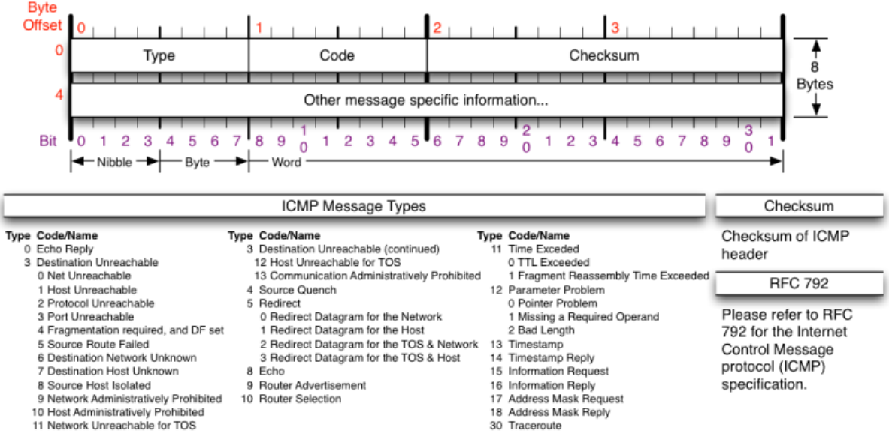
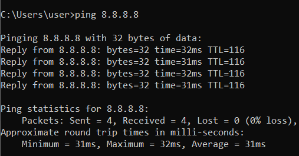
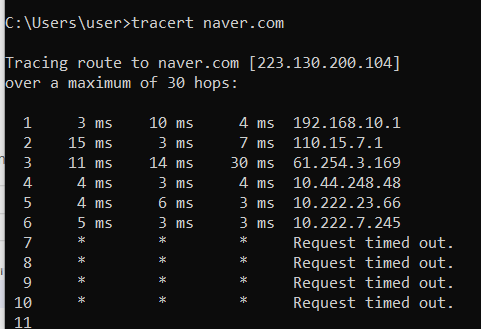

# ICMP

[[IP]]를 보조하는 [[프로토콜]]. OSI 기준 3.1 정도 수준에 속한다. 

IP나 UDP 같은 프로토콜은 TCP와 달리 오류 체크 기능이 없다. ICMP는 통신이 제대로 되었는지 [[신뢰성]]을 확보하는 등 보조 기능이 포함되어 있다. 

데이터를 싣고 나르는 프로토콜이 아니므로 자주 별 의미 없는 데이터(ping의 경우 32바이트, 용량은 얼마든지 늘리고 줄일 수 있다)가 포함된다. 

## ICMP의 타입

타입은 ARP의 opcode처럼 여러가지가 있다. 
크게 아래 두 가지로 나눌 수 있다. 

1. 질의 메시지
질의를 하고 상대방에게 응답을 받는다. 

2. 오류 보고 메시지
상대방에게 오류가 있다고 일방적인 메시지를 발신한다. 3, 4, 5, 11, 12번 코드를 참조.

## 주요 세부 타입 코드

- **0: echo 응답 - ip 호스트 진단(ping 응답)**
- **8: echo 요청 - ip 호스트 진단(ping 요청)**
**(둘이 짝을 이뤄 icmp 패킷을 보내 ping을 한다)**
- **3: 수신처 포트 도달 불가능 - 목적지 도달에 실패했음을 알림**
- 1: 수신처 호스트 도착 불가능
- 4: 발신 제한Source Quench - 네트워크가 혼잡해 데이터를 폐기함을 고지
- 5: 라우터 변경redirect - 라우터가 최적 [[라우팅 경로]]를 사용하지 않은 호스트를 발견시 대체 경로를 고지 - 해킹에 사용되는 일이 많아 윈도 xp 이후 시기로는 별 의미가 없다
- **11: 시간초과time exceeded 알림 - [[TTL]]이 0이 되어 더 이상 전송이 안됨을 알림.**
- 12: 파라미터 불량 - 헤더 값에 문제가 있으면 알림
- 13: 타임스탬프 요청
- 14: 타임스탬프 응답
(13, 14가 짝을 이루어 패킷이 오고가는데 필요한 왕복 시간 확인) 
- 15: 정보 요청 - [[IP 주소]] 가 없는 호스트에서 ip 설정을 위해 ip를 요청 - 최근엔 [[DHCP]]가 대체함.
- 16: 정보 응답
- 17: 주소 마스크 요구 - 호스트가 라우터에게 [[서브넷 마스크]] 요청 - [[DHCP]]가 대체함
- 18: 주소 마스크 응답 

## ICMP [[헤더]]

(위 이미지에 ICMP 세부 타입 코드의 목록이 기록되어 있다.)

타입에 따라 헤더의 구조가 많이 달라진다. 

## cmd 명령어

- ping - 코드 0, 8 을 주고 받아 상대 장비의 생존여부를 확인한다.

- tracert(trace route) - 목적지까지의 경로를 찾아준다, TTL을 증가시키면서 패킷을 보내고 경로의 IP 주소를 확인한다. 그러나 모든 라우터나 방확벽이 tracert에 응답하지는 않는다. (3계층 이상의 장비가 응답할 수 있다.) - 네트워크 [[트러블슈팅]]에 자주 사용

[//begin]: # "Autogenerated link references for markdown compatibility"
[IP]: IP.md "IP"
[프로토콜]: 프로토콜.md "프로토콜"
[라우팅 경로]: <라우팅 경로.md> "라우팅 경로"
[TTL]: TTL.md "TTL"
[IP 주소]: <IP 주소.md> "IP 주소"
[DHCP]: DHCP.md "DHCP"
[헤더]: 헤더.md "헤더"
[//end]: # "Autogenerated link references"