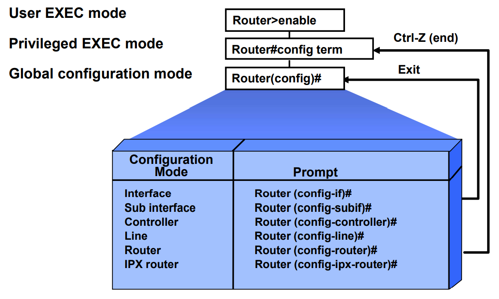

# IOS

[[시스코]]사 네트워크 장비 대부분이 사용하는 OS.
CLI로 장비 제어가 가능하다. 

## 영역 기반의 설정

전역구성모드에서는 장비의 전역 설정을 바꾼다. 
장비의 개별 [[인터페이스]] 설정 모드로 전환해야 로컬 인터페이스 설정이 된다. 

## IOS에서 실행 모드

- 유저 실행 모드 - 사용자 수동 설정 모드 
- 특권 실행 모드 - 상세한 점검이 가능한 모드 
- 전역 설정 모드 - 라우터의 본격 설정 모드
- ROMMON 모드 - 공장 초기화 상태나 사고 이후 ROM에 있는 파일만 가지고 부팅하는 모드(안전모드)
- Setup 모드 - 처음 실행시 yes 설정하면 실행하는 모드

## 주요 명령어

- Ctrl+shift+6 - 프로세스 간섭하기
- ? - 도움말 띄우기
- **enable** - 특권 실행모드(privileged exec mode)로 전환(호스트 이름 뒤에 '\#'이 붙는다) - 장비의 정보를 조회할 때 자주 사용
- 명령어 일부 + ? - 비슷한 명령어 찾기 - 시스코 자격증 시험에서는 사용할 수 없다
- 완성된 명령어 + ' ?' - 해당 명령어 다음에 들어갈 수 있는 인수 목록 출력 
- tab - 자동완성
- exit - 한 단계 전 모드로 돌아간다
- ctrl+c - 특권 실행모드로 돌아간다

### 특권 실행모드에서 자주 쓰는 명령어

- show - 해당 시점의 정보 한 번 출력 
- debug - 실시간으로 계속 정보 출력
- show ip interface brief - 모든 인터페이스 정보의 요약
- **configure terminal(conf t)** - 전역구성모드(global configuration mode) - 실제 장비의 설정이 가능한 모드 - *전역 구성 모드에서는 명령어 앞에 do를 붙여야 정보 조회가 된다
- show running-config - 현재 장비설정 조회
- show version - IOS 버전 정보 확인
- show interface - 인터페이스 정보보기
- show 인터페이스 \[이름\] - 특정 인터페이스 정보보기
- no ip domain-lookup - 명령어 중 오타난 명령어를 도메인 주소 검색에서 제외하기
- show ip interface brief - ip 인터페이스의 상태 요약

### 전역구성모드 명령어
- en - conf t - 특권실행모드+전역구성모드 
- hostname \[이름\] - 호스트명 바꾸기
- **interface \[인터페이스 이름\]** - 개별 인터페이스 수정 모드(interface configuration mode)로
- copy running-config startup-config' - 설정 저장 
- erase startup-config - 설정 삭제
- reload 초기화 

## 패스워드 걸기 예
- 전역구성모드에서 enable password [비밀번호] 예) enable password 1234

## 장비공장 초기화 방법

다음 명령어를 순서대로 입력한다. 
- write erase - startup-config를 삭제한다.
- reload - 재부팅

## 관련 저장 장치
- RAM - Running-config가 저장 - 부팅할 때 NVRAM\(비휘발성 메모리\)에서 startup-config를 로드하여 생성함. 
- Flash - IOS의 이미지가 저장됨, SSD와 유사.
- ROM - 쓰기 불가능. 공장추로시에 가장 초기 파일들이 저장됨.
- NVRAM - 비휘발성 메모리, startup-config 저장.

## 명령어 모음 예
shitf+?로 연다.

[//begin]: # "Autogenerated link references for markdown compatibility"
[시스코]: 시스코.md "시스코"
[//end]: # "Autogenerated link references"