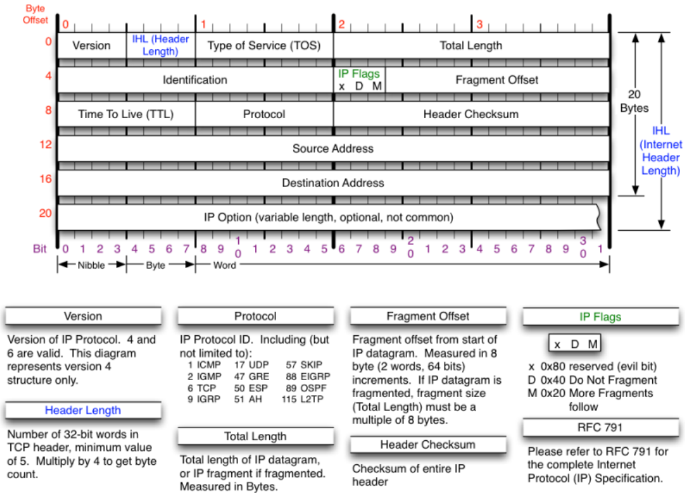
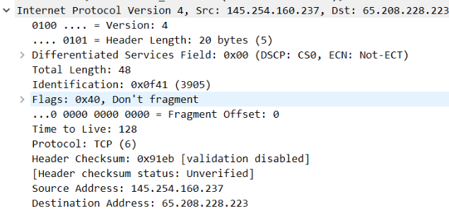
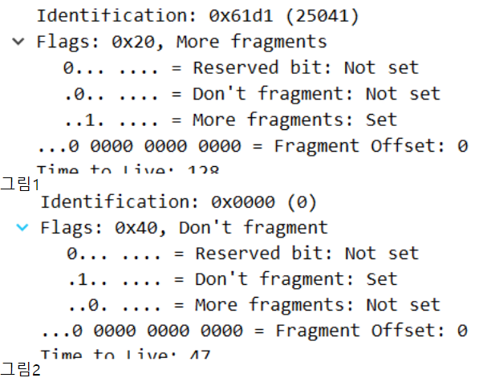

# IP 헤더

#암기

[[TCP-IP]] 통신에 사용되는 헤더.

IP 헤더는 일반적으로 20바이트 크기  
4바이트 씩 5줄로 20바이트다. 각 줄에는 데이터 필드가 있다. 

## 헤더 첫 줄 

첫 줄의 맨 처음에는 버전이 온다. Version: 4bit, IPv4인지, IPv6인지 - 위 이미지ㅇ의 첫 줄, "Version: 4" 부분(0100은 십진법으로 4다.) 
첫 줄 두번째 필드의 IHL은 IP 헤더 길이를 말한다. 실제 헤더 길이를 4로 나눈 값이 저장된다. - 0101은 십진법으로 5이므로 4를 곱하면 헤더의 길이가 20임을 알 수 있다. 
1-3 필드의 TOS는 Type of Service다. 거의 사용하지 않는다. 통신의 QOS(Quality of Service)와 관계가 있다. 예컨대 깨짐 없이 보낼 것인가(신뢰성) 속도가 중요한가 등 통신의 어떤 부분을 중요시하는가에 관한 타입을 입력한다. - 별로 중요하지는 않다. 
1-4의 Total Length는 IP 헤더와 데이터 길이(IP 헤더를 제외한 나머지인 페이로드payload)를 합친 총 길이이다.  

## 헤더 둘째 줄

두 번째 줄의 3개 필드는 [[단편화]]fragmentation과 관계 있다.  

2-1의 Identification - 단편화된 조각의 구분자 - 연달아 있는 패킷은 패킷번호도 연달아 이어진다 - 같은 데이터를 쪼갠 패킷은 identification 값이 같다 

2-2의 IP Flags - 단편화 옵션 - 3비트 - D: Do not frag, M: more frag  

*참조: 깃발 들기=1=참, 깃발 내리기=0=거짓의 도식이 있다 

그림1에서는 2번째 줄과 3번째 줄의 두 플래그의 .0.. ….과 ..1. ….만 확인하면 된다. M 플래그가 1이면 "조각이 더 없으므로" 패킷의 마지막 조각이다. 
그림2는 HTTP의 패킷으로 Don't fragment 플래그가 1이므로 조각내지 않은 패킷임을 확인할 수 있다.  

2-3의 Fragment OFFSET - 단편화된 조각의 위치 - 같은 identification을 가진 패킷을 합칠 때 사용할 위치이다 - 숫자는 데이터 시퀀스에서 시작 위치를 말한다. 

## 헤더 셋째 줄

3-1 TTL은 Time to Live다. 네트워크에서 패킷의 수명을 의미한다. 라우터 같은 3계층 장비가 여럿일 때 3계층 장비 사이의 거리를 '1홉'이라고 한다. 어떤 패킷의 TTL이 128이라면 128홉 동안 통신할 수 있음을 의미한다. - 패킷의 TTL은 장비 하나를 지날 때마다 1홉 당 1씩 감쇄한다. 그리고 TTL이 0이 되면 네트워크에서 소멸한다. - 네트워크를 영원히 헤매는('루프'가 일어난다고 말한다) 패킷이 너무 많아지지 않게 하는 역할이다. - 운영체제 별로 TTL이 다르다. 윈도는 128, 리눅스, 안드로이드, 아이폰은 대체로 64다. 시스코 장비는 255가 다수다. **패킷만 보고 상대 OS를 짐작할 수 있다는 것.** 

3-2 프로토콜은 [[상위 프로토콜 지시자]]다. 데이터에 포함된 상위 프로토콜의 종류를 알려준다. - {01: ICMP(4계층은 아니지만 IP보다 살짝 위에 있다), 06: TCP, 17: UDP} 

3-3 헤더체크섬은 TCP의 오류체크와 달리 데이터의 신뢰성을 체크하지 못한다. 헤더의 오류를 체크하는 기능만 맡는다. - 별로 안 중요함 

## 나머지 헤더

4, 5는 보내는 주소source address와 받는 주소destination address, 각각 32비트를 저장한다.  

6은 별로 중요하지 않다. IP 전달에 걸린 시간, 라우터에 특수 명령 내리기 등 