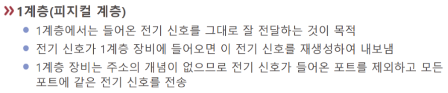

# L1-물리

전기 신호의 연결을 담당하는 층으로 전압과 케이블의 재질 등에 관한 [[표준]]이 있다.  

주요 장비: **허브**, 리피터, **케이블**, 커넥터, 트랜시버, 탭 

[[허브]]는 3개 이상 네트워크 장비의 통신 허브이다. 일반적으로 허브 같은 1계층 장비는 2계층 이상의 신호를 이해하지 못한다.  

허브는 *단순한 [[전기 신호]] 복제*가 주 기능 - 그러다보니 보안도 안 좋고 리소스 낭비가 심하다 - 그래서 최근은 안 쓰는 편이다.

리피터 - 100미터 이상 통신하기 위한 신호 증폭 장비로 우리가 직접 볼 일은 없다 - 그러나 *기본적으로 모든 통신 장비는 리피터 역할을 한다* - 들어온 신호는 알아서 증폭되어 나간다 

[[케이블]] - 랜선 

커넥터 - 랜선과 연결되는 부분 

트랜시버 - 신호를 바꿔주는 것 - 기술발달로 점점 보이지 않는다 

탭 - 선을 따는 장비 - 연결된 선에서 신호를 외부로 복제할 수 있다 - 도청 느낌

# 

OSI에서 1계층은 상대적으로 MLOps와 관련이 없는 편. 

[[ISP]]의 [[통신 기사]]들이 주로 다룬다. [[전기 기사]] 등. 

그러나 현실적으로 취업하면 생각보다 관계 많다. 전문 업체를 안 부르고 직접 할 때에는 직접 1계층을 깔게 되는 경우도 있다.  

[//begin]: # "Autogenerated link references for markdown compatibility"
[표준]: 표준 "표준"
[허브]: 허브 "허브"
[전기 신호]: <전기 신호> "전기 신호"
[ISP]: ISP "ISP"
[//end]: # "Autogenerated link references"
[//begin]: # "Autogenerated link references for markdown compatibility"
[표준]: 표준 "표준"
[허브]: 허브 "허브"
[전기 신호]: <전기 신호> "전기 신호"
[ISP]: ISP "ISP"
[//end]: # "Autogenerated link references"