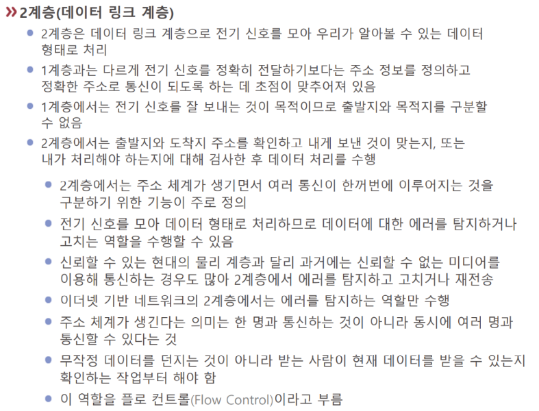

# L2-데이터링크

2계층은 [[전기 신호]]가 [[디지털 신호]]로 변환되어 의미를 가지게 된다. 인간이 읽을 수 있는 형태로 처리된다.  

**핵심: 주소 정보의 정의와 정확한 주소로의 전송.**

2계층부터는 상징적인 **주소**가 부여되므로 하나의 네트워크 내에서 **여럿이 통신하는 것이 가능해다** - 이 주소를 **MAC 주소**(근접거리 물리 주소)라고 부른다. - MAC주소는 해당 장비의 실제 물리적 주소로 공장에서 부여되며 16진수를 사용한다.

또한 **데이터의 에러를 탐지하거나 고치는 역할 수행 - 오류체크** 
 
>대표적인 블루투스 예)
예컨대, 블루투스 장비의 주소는 각각의 장비가 다르다. - 블루투스는 근거리에서 장비를 구별하고 통신하는 것 
마찬가지로 일반적인 경우 2계층은 근거리의 데이터 통신을 관장함 - LAN  
 
네트워크는 1계층과 2계층 만으로 충분히 '네트워크'인 편이다. 
블루투스로만 연결되어도 어쨌든 네트워크이다.  

 

[[플로우 컨트롤]] - 데이터 흐름의 조절, 스케쥴링 - 교차로 신호등 조절 컴퓨터 느낌 

 

오늘날 데이터 통신은 [[패킷 통신]]이라고 부른다.  

예전 전화 통신은 [[서킷 통신]] 

서킷 통신은 연결된 장비끼리만 통신 가능. 다른 장비가 중간에 연결이 불가함. 

그러나 패킷 통신은 회선을 점유하지 않고도 데이터를 일정한 패킷 단위로 쪼개서 대기시키고 하나씩 보내는 것.  

패킷 통신은 데이터를 주거니 받거니 하는 시공간적 과정을 스케쥴링과 오류 확인의 문제로 바꿔 버린다. 

 

디지털 통신 전반, 특히 네트워크는 패킷 통신이다.  

패킷을 주거니 받거니의 다른 의미: 양방향 통신 가능 - 주고 동시에 받는다 

2계층의 대표 장비는 스위치, [[NIC]] 

각기 다른 네트워크 장비가 3대 이상 통신하도록 도와주는 장비가 [[스위치]]로 MAC주소를 참조해 작동한다 - *허브와 비슷하지만*, 전기 신호의 단순 복제 이상으로 **MAC 주소를 통해 각각의 장비를 구별할 수 있다!** - [[플로우 컨트롤]]이 가능 

2계층 까지는 물리적이어서 사용자가 설정할 것이 많지 않다. - 연결만 하면 기본 기능이 잘 작동하는 편 

3계층부터 논리적 설정거리가 늘어난다.  

[//begin]: # "Autogenerated link references for markdown compatibility"
[전기 신호]: <전기 신호> "전기 신호"
[디지털 신호]: <디지털 신호> "디지털 신호"
[패킷 통신]: <패킷 통신> "패킷 통신"
[서킷 통신]: <서킷 통신> "서킷 통신"
[NIC]: NIC "NIC"
[스위치]: 스위치 "스위치"
[//end]: # "Autogenerated link references"