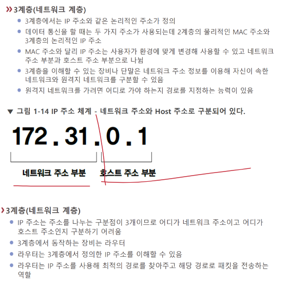

# L3-네트워크

대표 장비: [[라우터]]! - 이제 IP 주소가 중요 

[[IP]]가 작동하는 계층. 원거리 통신에 사용 

알아둘 것: 라우팅,[[서브넷 마스크]] 

네트워크 담당자가 있는 경우 라우터의 공인아이피와 게이트웨이, 서브넷마스크를 확인하고 네트워크를 설정하면 된다.  

네트워크에서 상대와 통신하려면 [[IP 주소]]를 알아야 

근거리에서는 [[MAC 주소]]를 알면 되지만 말이다 

목적지의 IP를 알면, 내 네트워크와 같은 네트워크인지 네트워크 주소 부분으로부터 확인한다.  

같은 네트워크일 경우 MAC주소를 사용해 접속한다. 

목적지 IP가 나와 다른 네트워크이면 네트워크의 출입구인 게이트웨이로 데이터를 내보낸다. 그리고 상대주소의 장비 MAC주소로... 

 
위처럼 정확한 네트워크 경로를 선택하는 것을 [[라우팅]]이라고 한다. - 3계층의 기능 

[[라우팅 경로]]가 적힌 테이블을 [[라우팅 테이블]]이라고 한다.  

[//begin]: # "Autogenerated link references for markdown compatibility"
[라우터]: 라우터.md "라우터"
[IP]: IP.md "IP"
[IP 주소]: <IP 주소.md> "IP 주소"
[MAC 주소]: <MAC 주소.md> "MAC 주소"
[라우팅]: 라우팅.md "라우팅"
[라우팅 경로]: <라우팅 경로.md> "라우팅 경로"
[라우팅 테이블]: <라우팅 테이블.md> "라우팅 테이블"
[//end]: # "Autogenerated link references"