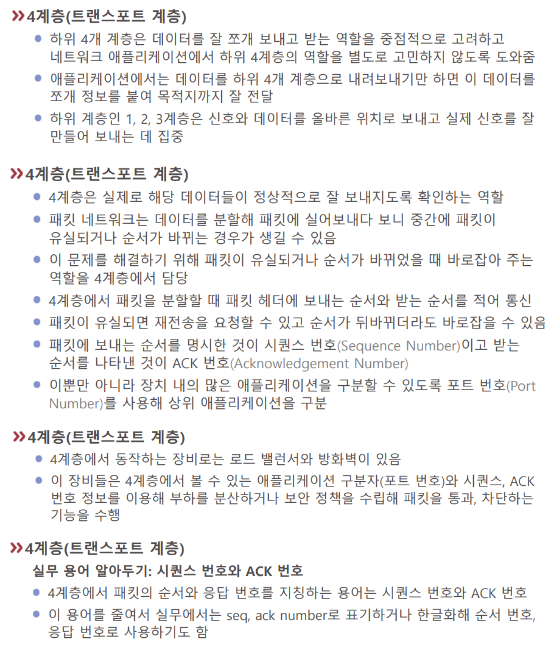

# L4-트랜스포트

4계층부터는 목표 통신 장비에 데이터가 도착해 있다.  

물리적 장비 찾기의 다음 단계 - 소프트웨어적으로 해당 프로그램에 접속하는 하드웨어와 소프트웨어의 접점 계층이다  

4계층의 기본 기능은 [[오류 점검]]과 흐름제어(flow control, [[플로우 컨트롤]]) 기능이다. 먼저 오류체크의 관점에서 받은 [[패킷]]이 깨짐 없이 도착했는지를 확인한다. 다음으로 흐름제어에서는 속도의 조절을 담당한다.  

그리고 4계층은 [[포트]]를 통해 어플리케이션을 구분한다. 
  
네트워크 상의 통신은 {프로세스-소켓-포트-(네트워크)-포트-소켓-프로세스}의 흐름을 갖고 있다.  

핵심 장비는 [[로드밸런서]]와 [[방화벽]]이다. 7계층 장비는 아래 쪽 토대인 3, 4, 7 계층을 다 이해할 수 있는 장비이다. 상위 계층의 장비는 2, 3, 4, 7 계층의 집합에서 하위 계층을 이해할 수 있다. 그러나 각각의 용도가 다르므로 더 높은 계층에서 사용하는 장비를 굳이 사용해야 하는 것은 아니다. 비용과 리소스 효율을 고려해 선택하면 된다. 또 회사마다 여러가지 노하우를 가지고 다양하게 구현된 장비가 많으므로 고려할 요소가 많다.  

[//begin]: # "Autogenerated link references for markdown compatibility"
[플로우 컨트롤]: <../플로우 컨트롤> "플로우 컨트롤"
[패킷]: 패킷 "패킷"
[포트]: 포트 "포트"
[방화벽]: 방화벽 "방화벽"
[//end]: # "Autogenerated link references"