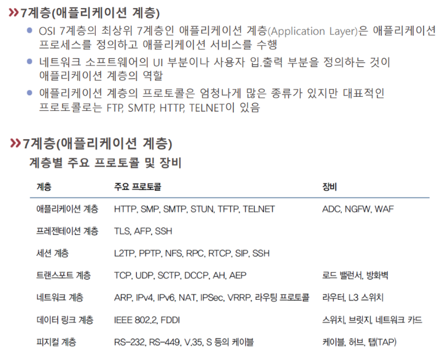

# L7-애플리케이션

7계층의 프로토콜은 실질적으로 상대방 [[프로세스]]에 데이터를 전달하는 것과 관련이 있다. 예컨대 웹에서 파일을 다운을 받을 때는 7계층에서 작동으로 파일을 받게 된다.  

7계층에는 낮은 계층에서 이더넷 프로토콜의 지배적 경향과 달리 아주 많은 프로토콜이 있다.

[//begin]: # "Autogenerated link references for markdown compatibility"
[프로세스]: 프로세스.md "프로세스"
[//end]: # "Autogenerated link references"