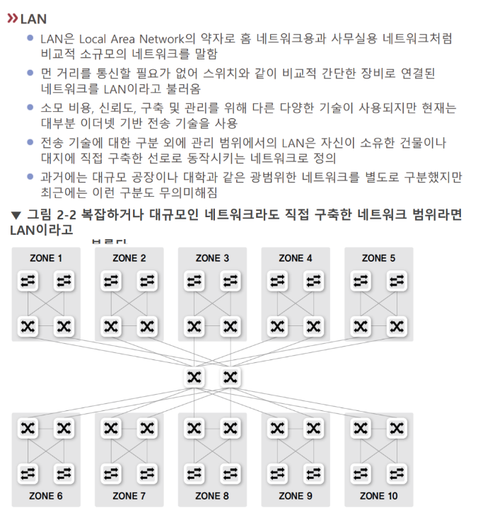

# LAN

Local Area Network.
국지적인 근거리 네트워크를 말한다. 

[[이더넷]]이 지배적인 프로토콜이다. 

## LAN 통신에서 통신장비가 네트워크 패킷을 수신하는 경우 
어떤 패킷이 오면 [[랜카드]]는 패킷을 수신할지 폐기할지 결정한다.  
1. 유니캐스트인데 목적지가 자기 자신인 경우
2. 브로드캐스트
3. 멀티캐스트인데 목적지가 자기가 속한 멀티캐스트 그룹인 경우 
위 3가지 경우에 패킷을 수신한다.  

참고 - [[무차별대입모드]]

## 유니캐스트, 멀티캐스트, 브로드캐스트, 애니캐스트

LAN에서 통신방식으로 유니캐스트, 멀티캐스트, 브로드캐스트, 애니캐스트가 있다. 

유니캐스트는 1대1로 [[패킷]]을 보내며 근접 네트워크에서만 일어난다. 먼 거리의 네트워크에서 통신은 유니캐스트가 아니라 게이트웨이로 나가기부터 시작해야 한다.  브로드캐스트와 제일 많이 쓰이는 캐스팅 방식 .

브로드캐스트는 같은 네트워크의 모두에게 패킷을 보낸다. 유니캐스트와 제일 많이 쓰이는 캐스팅 방식. 그러나 리소스를 비효율적으로 사용하므로 [[IPv6]]에서는 사용하지 않는다.  

멀티캐스트는 같은 네트워크의 다수에게 패킷을 보낸다. 멀티캐스트는 [[라우터]]에 등록된 네트워크 내의 그룹에 패킷을 쏘는 방식으로 작동한다.  

## BUM 트래픽

Broadcast, Unknown Unicast, Multicast를 이른다.

Unknown Unicast는 정의상 유니캐스트지만 작동방식은 일종의 브로드캐스트이다. 

## 참조
[[LAN과 WAN]]

[//begin]: # "Autogenerated link references for markdown compatibility"
[이더넷]: 이더넷 "이더넷"
[무차별대입모드]: 무차별대입모드 "무차별대입모드"
[패킷]: 패킷 "패킷"
[IPv6]: IPv6 "IPv6"
[라우터]: 라우터 "라우터"
[LAN과 WAN]: <LAN과 WAN> "LAN과 WAN"
[//end]: # "Autogenerated link references"