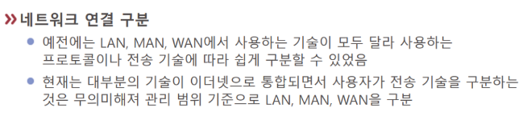

# LAN과 WAN

예전에는 [[LAN]], MAN, [[WAN]]의 구분을 프로토콜이나 전송 기술 같은 기술 인프라에 따라 정했다.

현대에는 기술 인프라의 변화로 [[이더넷]]의 지배적 경향으로 인해 기술 단위가 아니라 범위 단위로 구분하는 경향이 크다 - 구분이 명확하지 않아졌다.

통신기지국 수준을 거쳐 광케이블로 연결되는 구간이 아니면 대부분 이더넷을 사용한다.

[//begin]: # "Autogenerated link references for markdown compatibility"
[LAN]: LAN.md "LAN"
[WAN]: WAN.md "WAN"
[이더넷]: 이더넷.md "이더넷"
[//end]: # "Autogenerated link references"