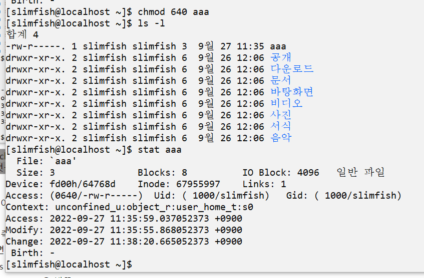
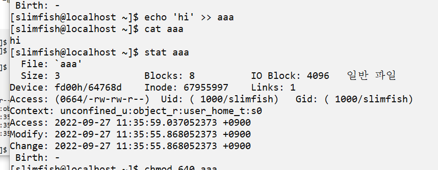

# MAC 시간

[[리눅스]] [[파일 시스템]]에서 파일의 modify, access, change로 나뉘는 시간 계산법. 

## modify와 access, change의 차이 

  
modify - 파일의 내용, 즉 데이터를 바꿈  
- modify time이 바뀌면 change time도 바뀐다! 
- modify 시간이 access 시간보다 빠르면 **복사된 파일**이다. - 포렌식에서도 사용.

access - 파일에 접근함

change - 파일의 권한permission을 바꿈 

## MAC 시간 예제

퍼미션을 바꾼 경우가 change.
change 시간만 바뀐 것을 확인 가능. 

aaa에 hi를 추가 후 조회한 mac 타임의 변화. 
modify 시간과 change 시간이 동시에 바뀐다. 

[//begin]: # "Autogenerated link references for markdown compatibility"
[리눅스]: 리눅스.md "리눅스"
[파일 시스템]: <파일 시스템.md> "파일 시스템"
[//end]: # "Autogenerated link references"