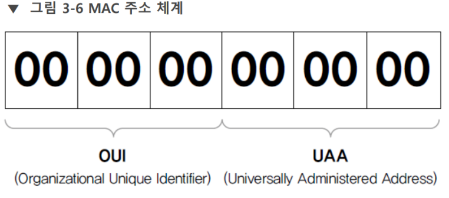

# MAC 주소

근접 거리 물리 주소. MAC 주소는 Media Access Control의 줄임말이며 공장에서 생성한 물리적 주소이다. 해당 장비의 실제 물리적 주소로 공장에서 부여되며 16진수를 사용한다. 각 [[NIC]]는 공장에서 생산할 때 부여한 MAC 주소를 가진다.
이더넷 표준인 [[IEEE 802]] 기술에서 [[L2-데이터링크]] 계층 주소로 사용한다.  

**네트워크에 접속하는 모든 장비는 MAC 주소가 있어야 한다.**  

주소는 [[NIC]]에 할당되어 있다. 그러므로 주소는 단말이 아니라 NIC에 종속된다. NIC가 여럿이면 MAC 주소도 여럿이다. 멀티레이어 스위치, 라우터 등 복잡한 네트워크 장비는 NIC가 여럿이다.  

일반적으로 ROM 형태로 고정되어 출하된다. 그러나 어디까지나 메모리에 적재되어 구동되므로 바꿀 수 없는 것은 아니다.  

윈도에서는 드라이버 상세 정보에서 MAC 주소 변경을 제공하면 쉽게 변경할 수 있다.  

리눅스는 GNU MacChanger나 각 리눅스 배포판의 네트워크 설정 파일에서 주소를 변경할 수 있다. 

또 별도로 하드웨어적 솔루션이 제공되기도 한다.  

## MAC 주소의 체계 

 
네트워크 장비 제조업체에 주소 풀을 할당하는 것을 [[제조사 코드]]라고 부른다. 이 주소는 국제기구인 [[IEEE]]가 관리한다.   

각 주소는 고유해야 하는 것이 원칙이다. 그러나 오류나 의도로 주소가 중복될 수도 있다. 그러나 동일 네트워크에서만 중복되지 않으면 문제가 없다.  

16진수 12자리 48비트로 표현한다. MAC 주소의 앞 부분인 OUI는 [[제조사 코드]]이다. 뒷 부분인 UAA를 각 제조사가 할당하여 각 장비를 구분하게 한다. 

OUI Lookup Tool이나 [[IEEE]] 홈페이지에서 OUI로 제조사를 조회할 수 있다.  

[//begin]: # "Autogenerated link references for markdown compatibility"
[NIC]: NIC.md "NIC"
[IEEE 802]: <IEEE 802.md> "IEEE 802"
[L2-데이터링크]: L2-데이터링크.md "L2-데이터링크"
[NIC]: NIC.md "NIC"
[IEEE]: IEEE.md "IEEE"
[IEEE]: IEEE.md "IEEE"
[//end]: # "Autogenerated link references"