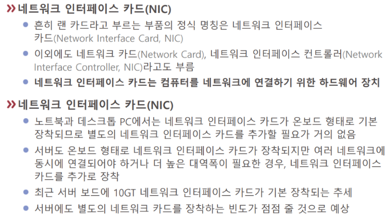
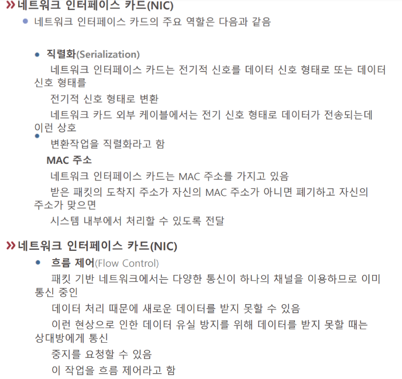
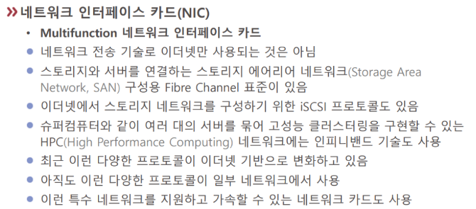

# NIC (랜카드)

NIC는 네트워크 [[인터페이스]] 컨트롤러, 네트워크 카드, 랜카드(속어), 물리 네트워크 인터페이스, [[이더넷]] 카드, 네트워크 어댑터, LAN 어댑터 등으로 부른다.  

NIC도 [[가상화]]가 가능하므로 여러 프로그램을 설치하면 노트북도 NIC나 보안 장비로 바꾸는 것이 가능하다. 그러나 100만원짜리 노트북을 30일 연속으로 켜두면 장비가 노후화되고 비용이 아주 많이 들 것이다. 그런 이유로 전문적 통신 장비를 사용하는 것이다.  
[[클라우드 환경]]에서는 NIC도 가상화되어 여럿인 경우가 있다. 

기능들
- [[직렬화]]
- [[MAC 주소]] 제공
- [[플로우 컨트롤]]

통신 장비가 아니라 저장 장비와 통신하는 경우가 있다. 즉, 스토리지가 한 컴퓨터 내부가 아니라 외부에 네트워크로 연결된 경우가 있다. 이러한 특수 네트워크에서 별도의 프로토콜을 사용하는 가속용 네트워크 카드도 있다. 

[//begin]: # "Autogenerated link references for markdown compatibility"
[이더넷]: 이더넷.md "이더넷"
[클라우드 환경]: <클라우드 환경.md> "클라우드 환경"
[직렬화]: 직렬화.md "직렬화"
[MAC 주소]: <MAC 주소.md> "MAC 주소"
[플로우 컨트롤]: <플로우 컨트롤.md> "플로우 컨트롤"
[//end]: # "Autogenerated link references"