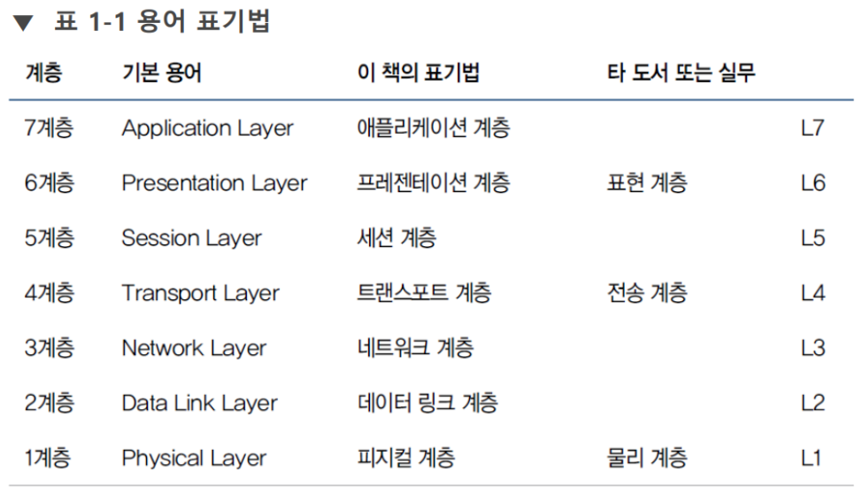

# OSI 7계층

7계층은 암기할 것 #암기
# 
현대의 인터넷에서는 [[TCP-IP]] 4계층 모델이 선호되기도 함 

그러나 OSI 7계층이 기본이다
TCP/IP 모델은 OSI(12-3-4-567)에 대응한다. 
현실에 쉽게 '반영'하기 위한 목적의 단순화 경향이 있는 것. 
#

각 계층별 설명
[[L1-물리]]
[[L2-데이터링크]]
[[L3-네트워크]]

[//begin]: # "Autogenerated link references for markdown compatibility"
[TCP-IP]: TCP-IP "TCP-IP"
[L1-물리]: L1-물리 "L1-물리"
[L2-데이터링크]: L2-데이터링크 "L2-데이터링크"
[L3-네트워크]: L3-네트워크 "L3-네트워크"
[//end]: # "Autogenerated link references"