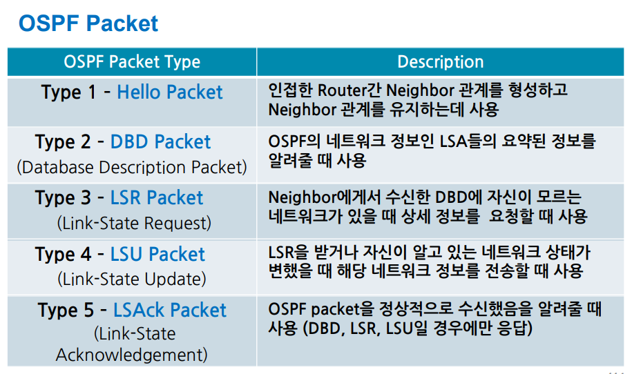

# OSPF

- Link-state 방식의 [[동적 라우팅 프로토콜]].
- **전체 [[네트워크 토폴로지]]를 모든 [[라우터]]가 공유한다!**
- 클래스리스로 [[VLSM]]과 CIDR를 지원한다. 
- [[메트릭]]은 cost를 사용한다. (10^8의 [[대역폭]] bandwidth)
- 멀티캐스트로 정보를 전달한다. 
- [[AD]] 값은 110이다. 
- [[다익스트라 알고리즘]]을 사용해 각 목적지까지의 최소 경로를 계산한다. 
- [[표준]] 라우팅 프로토콜이다. 
- [[수렴 시간]]이 전반적으로 빠르다. (EIGRP 보다는 조금 느리다.)
- Stub이라는 강력한 주소 축약 기능이 있다. [[라우팅 테이블]]의 크기를 획기적으로 줄인다. 
- area 단위로 구성되어 대규모 네트워크를 안정적으로 구성할 수 있다.
- 그러나 설정이 복잡한 점이 단점이다. 

## OSPF의 네트워크 종류
1) Broadcast Multi Access
2) Point-to-Point
3) Non Broadcast Multi Access

## OSPF의 패킷 종류
#암기 1-3 유형

[//begin]: # "Autogenerated link references for markdown compatibility"
[동적 라우팅 프로토콜]: <동적 라우팅 프로토콜.md> "동적 라우팅 프로토콜"
[네트워크 토폴로지]: <네트워크 토폴로지.md> "네트워크 토폴로지"
[라우터]: 라우터.md "라우터"
[VLSM]: VLSM.md "VLSM, Variable Length Subnet Mask"
[메트릭]: 메트릭.md "메트릭"
[AD]: AD.md "AD(Administrative Distance)"
[표준]: 표준.md "표준"
[수렴 시간]: <수렴 시간.md> "수렴 시간"
[라우팅 테이블]: <라우팅 테이블.md> "라우팅 테이블"
[//end]: # "Autogenerated link references"