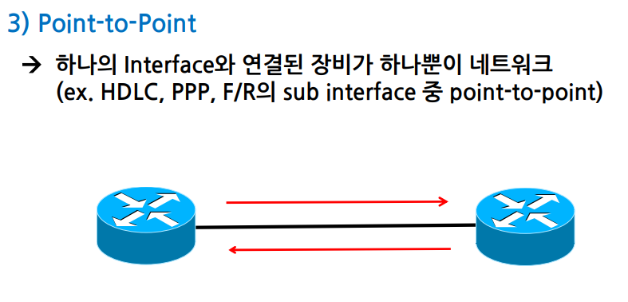

# OSPF

- Link-state 방식의 [[동적 라우팅 프로토콜]].
- **전체 [[네트워크 토폴로지]]를 모든 [[라우터]]가 공유한다!**
- 클래스리스로 [[VLSM]]과 CIDR를 지원한다. 
- [[메트릭]]은 cost를 사용한다. (10^8의 [[대역폭]] bandwidth)
- 멀티캐스트로 정보를 전달한다. 
- [[AD]] 값은 110이다. 
- [[다익스트라 알고리즘]]을 사용해 각 목적지까지의 최소 경로를 계산한다. 
- [[표준]] 라우팅 프로토콜이다. 
- [[수렴 시간]]이 전반적으로 빠르다. (EIGRP 보다는 조금 느리다.)
- Stub이라는 강력한 주소 축약 기능이 있다. [[라우팅 테이블]]의 크기를 획기적으로 줄인다. 
- area 단위로 구성되어 대규모 네트워크를 안정적으로 구성할 수 있다.
- 그러나 설정이 복잡한 점이 단점이다. 

## [[IOS]]에서 OSPF 설정 방법

process-id는 인터페이스가 속하는 OSPF 프로세스 번호이다. 일반적으로 같은 AS내에 OSPF 라우터들은 같은 번호를 부여하는데 달라도 상관은 없다. 다만 동일 라우터내에서 여러개의 OSPF를 운영하고자 한다면 다른 번호만을 이용하면 된다.
process-id는 1~65535까지 사용할 수 있다.

router-id는 기기마다 설정하게 되어 있는데 설정하지 않아도 된다. 설정하지 않으면 [[루프백 인터페이스]] 중 가장 높은 IP 주소로 설정한다. 루프백 인터페이스가 없으면 물리적 인터페이스 중 가장 높은 IP 주소로 설정한다.  

명령어 입력 후 clear ip ospf process로 재시작을 해주어야 라우터에 IP 주소가 설정된다.

## DR과 BDR

OSPF는 지정 라우터(designated router)와 백업지정라우터로 라우터의 상태에 따라 경로를 수정해 라우팅의 안정성을 제공한다. 

## Area

## OSPF의 네트워크 종류

요약

1) Broadcast Multi Access
- [[이더넷]]이 대표적인 BMA 방식.

2) Non Broadcast Multi Access
   

3) Point-to-Point

## OSPF의 패킷 종류
#암기 1-3 유형

[//begin]: # "Autogenerated link references for markdown compatibility"
[동적 라우팅 프로토콜]: <동적 라우팅 프로토콜.md> "동적 라우팅 프로토콜"
[네트워크 토폴로지]: <네트워크 토폴로지.md> "네트워크 토폴로지"
[라우터]: 라우터.md "라우터"
[VLSM]: VLSM.md "VLSM, Variable Length Subnet Mask"
[메트릭]: 메트릭.md "메트릭"
[AD]: AD.md "AD(Administrative Distance)"
[표준]: 표준.md "표준"
[수렴 시간]: <수렴 시간.md> "수렴 시간"
[라우팅 테이블]: <라우팅 테이블.md> "라우팅 테이블"
[IOS]: IOS.md "IOS"
[루프백 인터페이스]: <루프백 인터페이스.md> "루프백 인터페이스"
[이더넷]: 이더넷.md "이더넷"
[//end]: # "Autogenerated link references"
[//begin]: # "Autogenerated link references for markdown compatibility"
[동적 라우팅 프로토콜]: <동적 라우팅 프로토콜.md> "동적 라우팅 프로토콜"
[네트워크 토폴로지]: <네트워크 토폴로지.md> "네트워크 토폴로지"
[라우터]: 라우터.md "라우터"
[VLSM]: VLSM.md "VLSM, Variable Length Subnet Mask"
[메트릭]: 메트릭.md "메트릭"
[AD]: AD.md "AD(Administrative Distance)"
[표준]: 표준.md "표준"
[수렴 시간]: <수렴 시간.md> "수렴 시간"
[라우팅 테이블]: <라우팅 테이블.md> "라우팅 테이블"
[IOS]: IOS.md "IOS"
[루프백 인터페이스]: <루프백 인터페이스.md> "루프백 인터페이스"
[이더넷]: 이더넷.md "이더넷"
[//end]: # "Autogenerated link references"