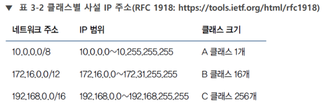

# RFC

Request for Comments. 

 

RFC는 ICT에 적용할 수 있는 제안, 조사 결과, 표준을 적어놓은 문서의 모음이다.  

 

RFC 중 의미 있는 문서가 IETF(Internet Engineering Task Force, 국제인터넷표준화기구)를 통해 표준으로 인정 받는다. [[인터넷]] [[표준]]과 [[프로토콜]]은 이러한 RFC의 집합이다.  

RFC 1918에는 클래스별 [[사설 IP 주소]]의 대역이 명시되어 있다.  #암기

[//begin]: # "Autogenerated link references for markdown compatibility"
[표준]: 표준 "표준"
[프로토콜]: 프로토콜 "프로토콜"
[//end]: # "Autogenerated link references"