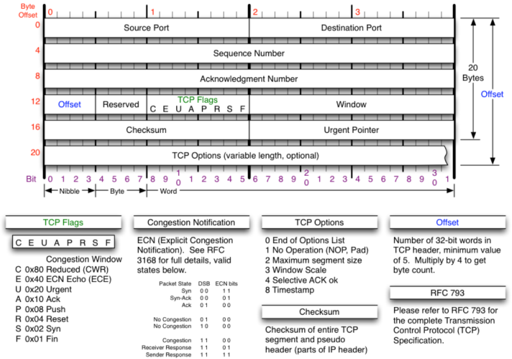
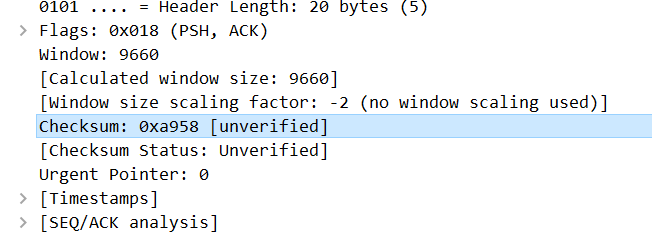

# TCP

[[L4-트랜스포트]] [[프로토콜]]이다.

[[TCP]]는 안정적인 전송이 목표이다. - [[신뢰성]]. 참조
연결 지향형 프로토콜로 연결을 수립한다. 목적지에 [[패킷]]이 도착했는지 확인하는 점이 특징. - [[3-way 핸드셰이크]] 참조 - 그러므로 긴 데이터 전송에 적합하다. 
[[윈도 사이즈]] 설정으로 [[플로우 컨트롤]]=속도 제어를 할 수 있다. - TCP에서 윈도 사이즈의 최대 크기는 2^16바이트다. 
대부분 어플리케이션에서 사용한다. 

## TCP 헤더

TCP 통신에서 붙는 [[헤더]].
대부분 헤더 크기는 20바이트다. 
헤더 첫 줄에서는 소스 [[포트]]와 목적지 포트를 확인할 수 있다. 

2, 3번 줄의 시퀀스 넘버=**SEQ**와 억널리지먼트 넘버acknowledgement nubmer=**ACK**로 통신이 문제 없는지 [[지속]]적으로 체크한다. 
유사 [[세션]]을 맺는 값, 혹은 패킷 번호로 여길 수 있다. 

4번 줄의 offset은 헤더의 길이가 담겨있다. 4를 곱해주면 된다. 
4-2 reserved는 6비트 크기이고 사용 안 한다. 

4-3 TCP 플래그는 6비트로 6개 플래그가 있다.
- U-URG - 긴급한 데이터가 있으면 1로 세팅
- A-ACK - 데이터의 수신 확인
- P-PSH - 보내는 데이터를 [[버퍼]]에 저장하지 않고 바로 전달
- R-RST - 연결이 비정상일 경우 연결 재수립 요청
- S-SYN - 연결 수립할 때 사용
- F-FIN - 연결 종료할 때 사용

checksum은 간단하게 오류를 체크하는 값이다. 

urgent pointer는 TCP 플래그에서 U에 체크되면 긴급한 데이터의 인덱스를 표기한다. - 실제로 거의 사용되는 일은 없다. 공격용 패킷을 볼 가능성이 높은 편이다. 

## 참조
[[TCP-IP]], [[TCP와 UDP]]

[//begin]: # "Autogenerated link references for markdown compatibility"
[L4-트랜스포트]: L4-트랜스포트.md "L4-트랜스포트"
[프로토콜]: 프로토콜.md "프로토콜"
[TCP]: TCP.md "TCP"
[패킷]: 패킷.md "패킷"
[3-way 핸드셰이크]: <3-way 핸드셰이크.md> "3-way 핸드셰이크"
[윈도 사이즈]: <../윈도 사이즈.md> "윈도 사이즈"
[플로우 컨트롤]: <플로우 컨트롤.md> "플로우 컨트롤"
[헤더]: 헤더.md "헤더"
[포트]: 포트.md "포트"
[세션]: 세션.md "세션"
[TCP-IP]: TCP-IP.md "TCP-IP"
[TCP와 UDP]: <TCP와 UDP.md> "TPC와 UDP"
[//end]: # "Autogenerated link references"