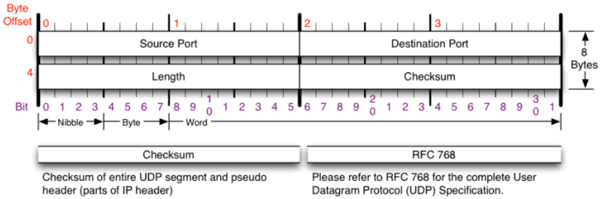

# UDP

[[L4-트랜스포트]] [[프로토콜]]이다.

### 특징
- 단순하고 빠른 데이터 전송이 목표. 
- 연결을 수립하지 않는다. (비연결형 프로토콜)
- 패킷이 도착했는지에 관심 없다. 
- [[플로우 컨트롤]] 불가. - 짧은 데이터 전송에 적합하다. 
- 데이터가 깨져도 상관 없는 경우 UDP 전송이 적합하다 - 음성, 영상 스트리밍 등 상황에서.
- [[DNS]], [[DHCP]], [[SNMP]], [[TFTP]], ... 등에서 대표적으로 사용된다.

## UDP [[헤더]]

UDP는 TCP와 달리 세그먼트 대신 데이터그램이라고 부른다.
8바이트 크기의 헤더가 달린다. 

출발 포트, 도착 포트, 데이터그램 길이, checksum(오류 확인 기능) 정도가 붙는다. 

별 기능이 없는 편. 

[//begin]: # "Autogenerated link references for markdown compatibility"
[L4-트랜스포트]: L4-트랜스포트.md "L4-트랜스포트"
[프로토콜]: 프로토콜.md "프로토콜"
[플로우 컨트롤]: <플로우 컨트롤.md> "플로우 컨트롤"
[DHCP]: DHCP.md "DHCP"
[헤더]: 헤더.md "헤더"
[//end]: # "Autogenerated link references"