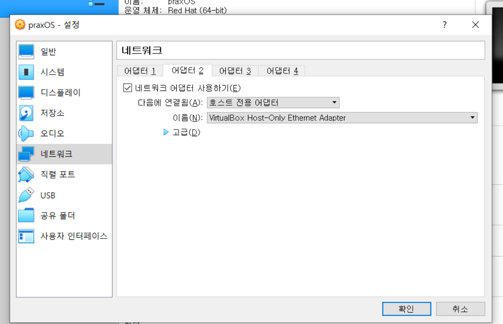

# VirtualBox

대표적인 [[가상화]] 기술. [[오픈소스]] 도구로 서버 가상화에 사용하며 [[리눅스]] 등 [[OS]]가 작동하는 [[가상머신]]을 생성할 수 있다. 

버추얼박스는 어플리케이션 가상화 소프트웨어다.  
운영체제를 설치하려면 기본적으로 컴퓨터가 있어야 한다. 클라우드 환경에서도 마찬가지. 컴퓨터가 있으려면 하드웨어가 있어야 한다. 컴퓨팅이라는 작업이 있을 때에는 하드웨어 위에 [[OS]]가 올라간다. 
하드웨어를 구성해주기 위한 소프트웨어가 버추얼박스이다. 하드웨어를 [[아이솔레이션]], 격리를 시켜서 가상화된 하드웨어를 만들어주는 소프트웨어. 

## 버추얼박스의 네트워크 종류
- Host-only 네트워크에는 버추얼박스를 실행하는 PC에서 직접 접근이 가능하다. 
- NAT 네트워크의 경우 가상머신의 포트로 접근해 [[포트포워딩]]을 해야 접근할 수 있다. 
- NAT는 다른 가상머신과 통신할 수 없다 

## 버추얼박스와 PC의 통신

버추얼박스는 버추얼박스 내부의 효과적 통신을 위해 [[랜카드]]를 2개 사용한다.  
호스트 전용 어댑터로 버추얼박스와 직접 소켓 통신을 할 수 있다. 
버추얼박스 환경이 아닌 경우 굳이 랜카드 2개 설정이 필요하지는 않다.  

[//begin]: # "Autogenerated link references for markdown compatibility"
[가상화]: 가상화.md "가상화"
[리눅스]: 리눅스.md "리눅스"
[OS]: OS.md "OS"
[가상머신]: 가상머신.md "가상머신"
[OS]: OS.md "OS"
[포트포워딩]: 포트포워딩.md "포트포워딩"
[//end]: # "Autogenerated link references"
[//begin]: # "Autogenerated link references for markdown compatibility"
[가상화]: 가상화.md "가상화"
[리눅스]: 리눅스.md "리눅스"
[OS]: OS.md "OS"
[가상머신]: 가상머신.md "가상머신"
[OS]: OS.md "OS"
[포트포워딩]: 포트포워딩.md "포트포워딩"
[//end]: # "Autogenerated link references"