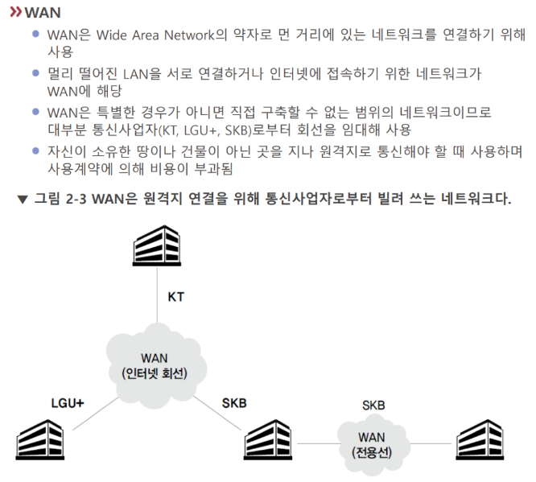

# WAN

Wide Area Network.

주로 [[ISP]]가 구축하는 광버위한 망. ISP가 아니고서는 네트워크 회선 망에 관여하기 어렵다. - 인터넷 임대비는 WAN 회선 사용비이다. 

기술이 발전하면서 WAN도 이더넷을 쓰게 되는 경향이 있다. 

[//begin]: # "Autogenerated link references for markdown compatibility"
[ISP]: ISP.md "ISP"
[//end]: # "Autogenerated link references"