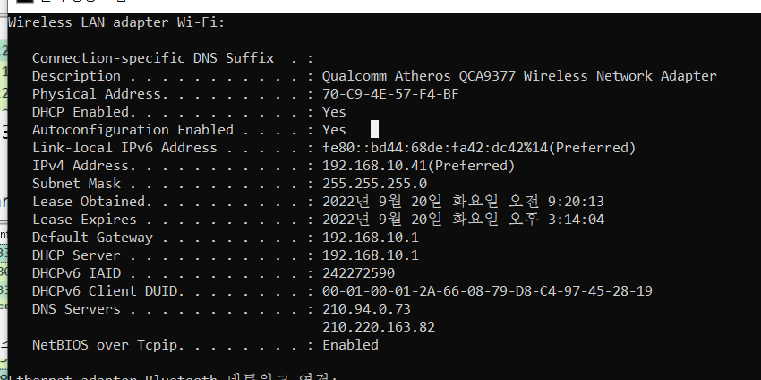
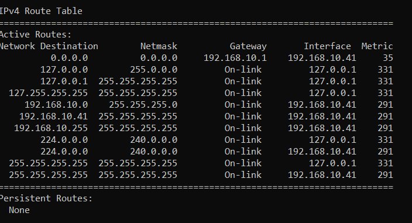
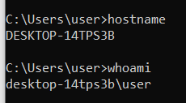
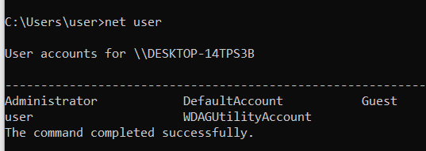

# 네트워크 관련 CMD 명령어

#팁
#암기

- ipconfig - 네트워크 인터페이스 정보확인
    **옵션**
    - /all -  [[MAC 주소]] 및 정보가 많아진다
    - /release - IP 주소를 해제하여 네트워크 연결을 끊음
    - /renew - [[IP 주소]]를 새롭게 갱신하여 네트워크 재연결
물리적 주소, IPv4 주소, 기본 게이트웨이, DNS 서버는 평생 괴롭히는 설정. 

- netstat: 사용중인 포트 정보 확인 
    **옵션**
    - -a: 전체 포트 표시
    - -n: 포트 번호를 숫자로 표시
    - -b: 해당 포트에서 동작중인 프로세스 확인

- nslookup: dns를 조회하는 명령어
  - nslookup dns이름 - 해당 dns의 IP 주소 확인.
  - 참조: [[DNS]]

- ping: ICMP 프로토콜을 사용해 상대방 호스트의 응답을 확인함. 

- tracert(리눅스에서는 traceroute) - 대상의 네트워크 경로를 확인한다. ([[ICMP]] 프로토콜 사용)

- arp -a - arp 캐시(테이블)을 확인한다. - 참조: [[ARP]]

- route print(netstat -nr) - [[라우팅 테이블]]을 확인한다. 
메트릭(Metric)이 높은 장비가 우선순위가 높은 편이다. 

- hostname - 컴퓨터의 통신 상 이름을 알 수 있다. (리눅스에서도 같다)

- net user - 컴퓨터에 있는 계정을 확인 가능

[//begin]: # "Autogenerated link references for markdown compatibility"
[ICMP]: ICMP.md "ICMP"
[ARP]: ARP.md "ARP"
[라우팅 테이블]: <라우팅 테이블.md> "라우팅 테이블"
[//end]: # "Autogenerated link references"