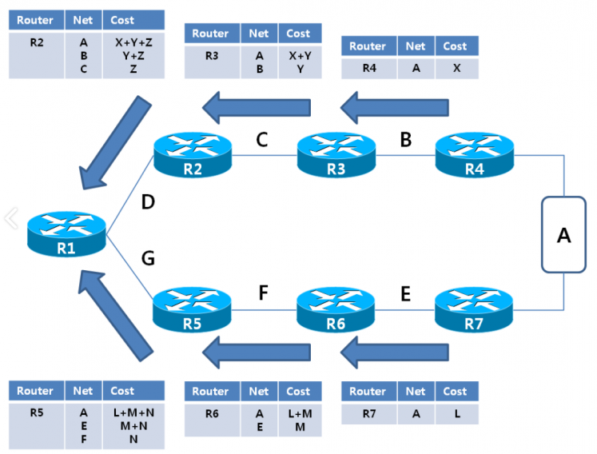
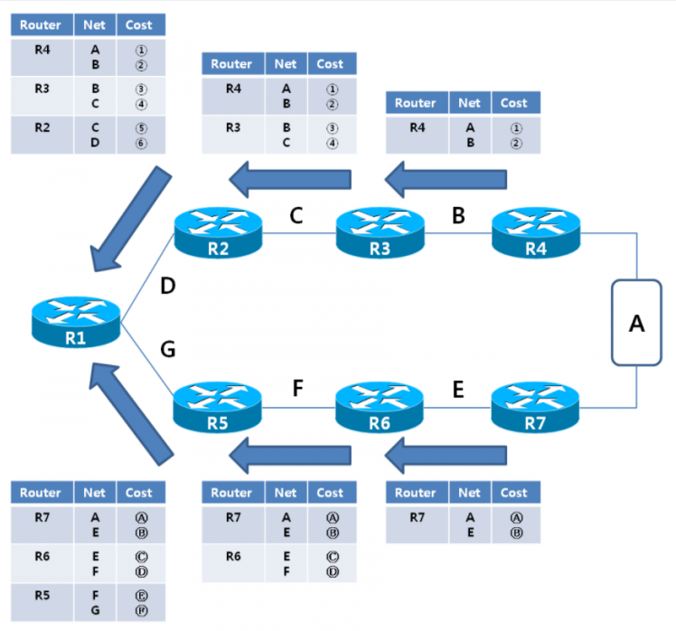

# 동적 라우팅 프로토콜

동적 라우팅은 라우터가 **자동으로** 최적 경로만 골라 [[라우팅 테이블]]에 경로를 추가한다. 이때 사용하는 [[프로토콜]]이 동적 라우팅 프로토콜이다. 

**주의**: 서로 같은 라우팅 프로토콜을 써야 라우터 간의 연결이 일어난다. 

*인터페이스마다 다른 프로토콜을 사용할 경우* 서로 다른 프로토콜을 사용하는 라우터를 연결하는 것은 어렵지 않다. 

## 동적 라우팅 프로토콜의 종류

#암기
크게 IGP(Internal Gateway Protocol)와 EGP(External Gateway Protocol)가 있다. 인터넷은 여러 단위의 [[AS]]로 쪼개져 있는데, AS 내부의 라우팅은 IGP를, AS 간의 라우팅은 EGP를 쓴다. AS와 AS의 경계에 있는 라우터는 서로 다른 AS를 네트워크로 묶어준다. 

EGP에는 거의 BGP([[경계 게이트웨이 프로토콜]]) 하나만 사용한다. 

### IGP의 유형들

1. 거리 벡터Distance Vector 라우팅 프로토콜 - 순수 물리적으로 최적경로 선택. - RIP(성능이 낮은 편), EIGRP(시스코 장비 독점의 혼성적 프로토콜)
  - 각 [[라우터]]가 직접 연결된 라우터에게 자신이 아는 모든 네트워크의 목록과 홉을 공유.
  - 라우터는 직접 연결된 이웃과 이웃에게 통보를 받은 네트워크 목록을 알게 되며 이웃 너머의 상세 [[네트워크 토폴로지]]를 알 수는 없다. 
  - 이웃과의 관계를 관점으로 토폴로지 정보를 구축하는 프로토콜.

2. 링크 상태Link-State 라우팅 프로토콜 - 링크의 상태로 최적경로 선택. 라우팅 경로가 폭넓게 공유되어 성능이 높다. - OSPF(성능이 좋고 [[표준]]으로 자주 쓰인다), IS-IS 
  - 각 라우터가 자신과 인터페이스가 직접 연결된 이웃 라우터에게 정보를 제공하면 그 정보는 다른 이웃으로 그 정보를 다시 전달한다. 
  - 모든 라우터는 인터페이스의 정보(IP 주소 등)와 각 인터페이스의 연결에 관한 전체 정보를 학습하게 된다. 
  - 토폴로지 정보는 어떤 라우터든 동일한 관점에서(전역적 관점에서?) 만들어진다. 
  - 토폴로지의 전체적인 형태를 알 수 있으므로 보다 나은 라우팅 결정을 내릴 수 있지만 더 많은 리소스를 소모하게 된다. 

## 동적 라우팅 프로토콜 심화

### RIP
- 버전 1은 서브넷 마스크 설정이 없다. 클래스풀 IP 주소 시대의 프로토콜. 버전 2는 클래스리스 주소를 사용할 수 있다. 
- 매트릭으로 홉을 사용한다. 15홉 내에서 단순한 경로설정을 맡는다. 
- 홉의 크기로 경로를 판단하며 네트워크의 대역폭에는 관심이 없다. 
- 최대 15까지 지원되는 소규모 네트워크에서만 사용할 수 있다. 
- 30초마다 정보를 공유한다. (수렴시간convergence time, 네트워크에 변화하면 라우팅 설정을 변경하는데에 걸리는 시간) - [[라우팅 루프]]가 발생할 확률이 높다. 
- 서브넷마스크를 사용해 자동으로 주소를 축약해준다. 그러나 주소 충돌 위험이 언제나 있기 때문에 초보자는 무조건 자동축약 기능을 사용하지 않는 것이 좋다. 네트워크 관련 장비의 설정에서는 자동축약은 어지간하면 사용하지 말자. 

시스코 장비 [[IOS]]에서 RIPv1 설정
전역구성모드에서, 
router rip (라우터 설정으로 들어가서)
network [광고할 네트워크 주소] (RIPv1 설정)
no auto-summary (자동 축약 기능을 중단시킨다)

### IGRP
- 90초마다 정보를 공유한다. 
  

[//begin]: # "Autogenerated link references for markdown compatibility"
[라우팅 테이블]: <라우팅 테이블.md> "라우팅 테이블"
[프로토콜]: 프로토콜.md "프로토콜"
[AS]: AS.md "AS, Autonomous System"
[라우터]: 라우터.md "라우터"
[네트워크 토폴로지]: <네트워크 토폴로지.md> "네트워크 토폴로지"
[표준]: 표준.md "표준"
[라우팅 루프]: <라우팅 루프.md> "라우팅 루프"
[IOS]: IOS.md "IOS"
[//end]: # "Autogenerated link references"