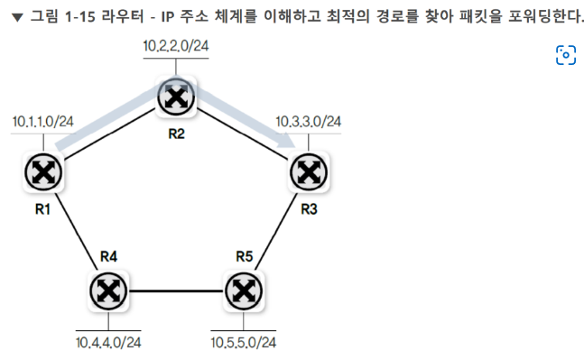
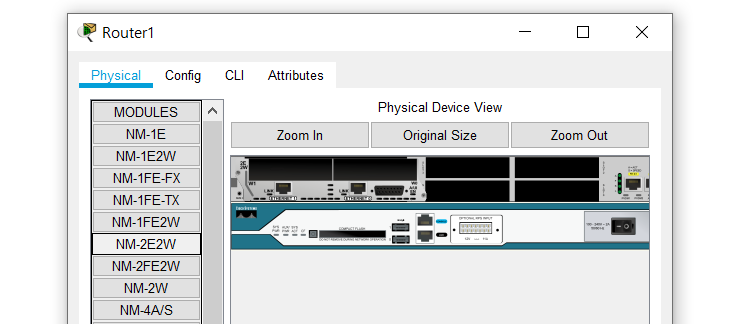
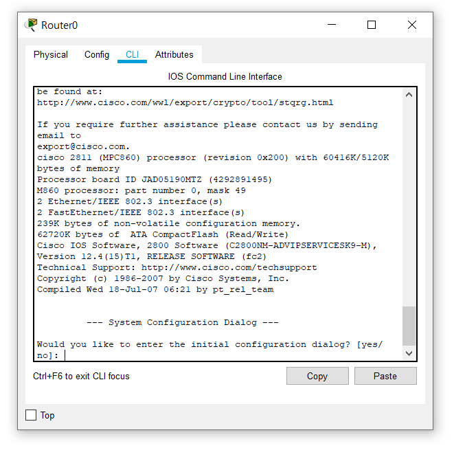
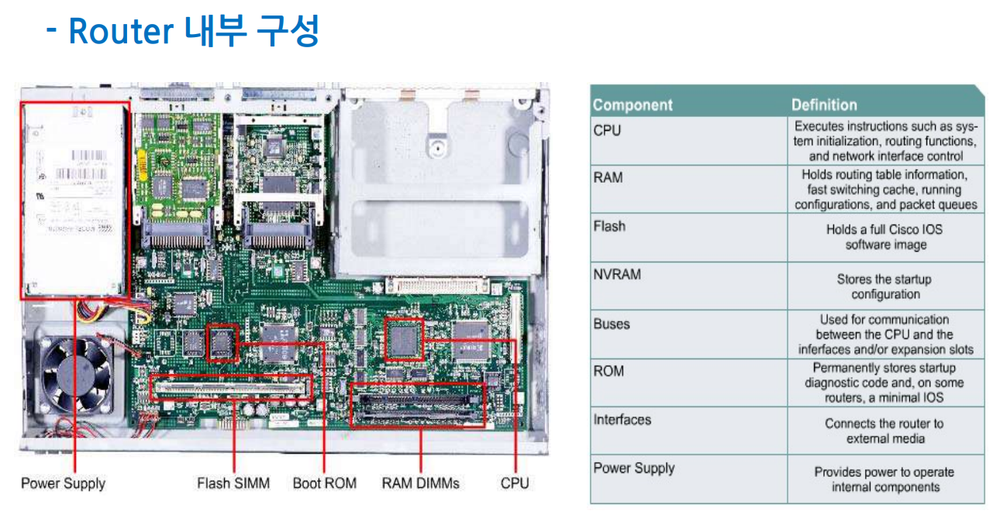
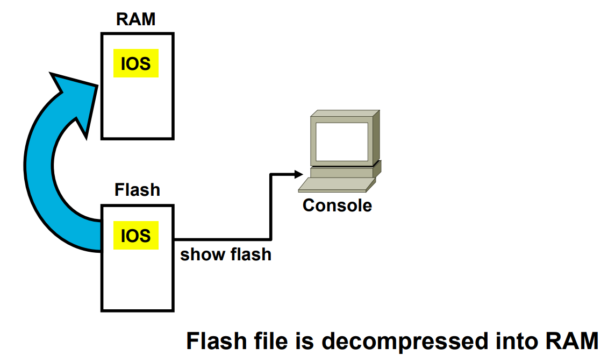
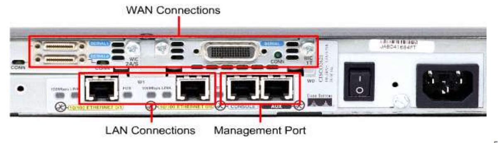
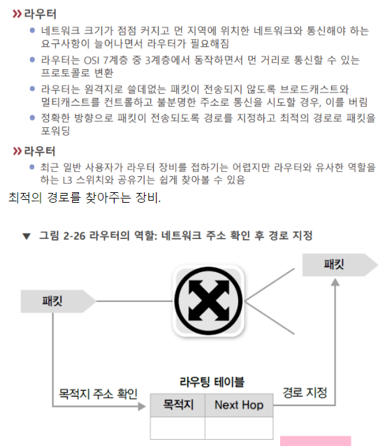

# 라우터

라우터는 그냥 [[NIC]]가 여럿 꽂인 장비이다. 한 라우터에 꽂힌 장비는 하나의 [[서브넷]]을 이루며 같은 네트워크는 네트워크 주소 부분이 같다.  
일반적으로 라우터에 외부 네트워크로 나가는 관문인 [[게이트웨이]] 역할이 있다. - 요즘 [[공유기]] 역시 게이트웨이 역할을 한다.  

기본적으로 인터페이스가 여럿이다. 특정 [[IP 주소]]의 인터페이스로 [[패킷]]이 들어오면 라우팅 테이블을 확인해서 적합한 출력 인터페이스의 IP 주소로 내보낸다. 인터페이스에서 인터페이스로 포워딩 하는 것이 라우터의 동작 원리.  

라우터는 메모리에 저장된 [[라우팅 테이블]]에 목적지 주소에 맞는 경로가 적혀 있지 않으면 해당 패킷은 버린다. 즉, 라우터는 브로드캐스트나 멀티캐스트로 일어나는 외부 네트워크의 불특정 다수로 전달되는 패킷을 차단한다.  

[[L3 스위치]]와 라우터는 거의 차이가 없어 개념적 구분이 어렵다.  
  

라우터는 [[IP 주소]] 체계를 이해하고 최적의 [[라우팅 경로]]를 찾아 [[패킷]]을 [[포워딩]] 한다. 
그러나 목적지까지 전송을 책임지지 않고 목적지 경로 상의 다음 라우터까지만 패킷을 전달한다. 이렇게 패킷을 전달하는 절차를 [[라우팅]]이라고 부른다.

[[LAN]]에서 WAN[[WAN]]Wide Area Network로 날아가는 메시지가 발생하면 라우터를 통해 다른 LAN의 라우터로 메시지를 전달하여 통신이 이뤄진다.

스위치는 하드웨어적 장비이지만 라우터는 보다 소프트웨어적이다. 라우터는 작은 컴퓨터로서 하드웨어 자체에 라우팅 기능이 있는 것이 아니라 소프트웨어적으로 라우팅 기능을 수행한다. 

## 라우터의 종류

라우터는 일체형=단독형과 모듈형이 있다. 모듈형은 모듈을 추가해서 보다 자율적인 개조가 가능하다. 

## 라우터의 CLI 조작

[[시스코]]의 경우 [[IOS]] 기반으로 작동하는 CLI로 라우터를 제어할 수 있다. 

## 라우터의 내부 구조

라우터도 작은 컴퓨터다. 

### 라우터의 기억 체계
- NVRAM은 전원이 꺼져도 저장된 내용이 사라지지 않는 비휘발성 메모리로 NVRAM에 올라간 설정내용은 시스코 장비 내에서 startup-config로 명명한다. 
- 반대로 RAM은 휘발성 메모리이며 시스코 장비 내에서 RAM에 저장한 구동 설정을 running-config라고 한다. 
- Flash는 [[IOS]] 등 [[운영체제]] 이미지를 저장한다. 
- ROM에는 복구용 소형 OS와 구동 중 점검 절차 등 Bootstrap이 저장되어 있다. - Flash가 날아가도 부팅이 가능하다. 

### 라우터의 부팅 시 로딩 도식

#암기
1. POST(Power on self test) - 부팅 중 테스트
2. 부트스트랩 코드 로딩과 실행 - ROM에서
3. IOS 소프트웨어 찾기 - Flash에서
4. IOS 소프트웨어 불러오기
5. 설정configuration 찾기 - NVRAM에서
6. 설정 불러오기 
7. 라우터 실행

## 라우터의 인터페이스 종류

[[LAN]] 구간과 [[WAN]] 구간, 관리용 구간의 인터페이스가 있다.

[[LAN]] 구간에는 흔히 쓰는 랜선인 UTP 케이블을 사용한다. 

## 라우터를 고를 때는
상위 회선의 인터페이스와 일치하는 WAN [[인터페이스]]를 가질 것.
WAN의 [[스루풋]]throughput을 고려할 것.
규모와 비용 대비 효과 면에서 라우터의 보안 기능에 의지해도 좋을지 검토할 것.

[//begin]: # "Autogenerated link references for markdown compatibility"
[NIC]: NIC.md "NIC (랜카드)"
[서브넷]: 서브넷.md "서브넷"
[게이트웨이]: 게이트웨이.md "게이트웨이"
[공유기]: 공유기.md "공유기"
[IP 주소]: <IP 주소.md> "IP 주소"
[패킷]: 패킷.md "패킷"
[라우팅 테이블]: <라우팅 테이블.md> "라우팅 테이블"
[L3 스위치]: <L3 스위치.md> "L3 스위치"
[IP 주소]: <IP 주소.md> "IP 주소"
[라우팅 경로]: <라우팅 경로.md> "라우팅 경로"
[패킷]: 패킷.md "패킷"
[라우팅]: 라우팅.md "라우팅"
[LAN]: LAN.md "LAN"
[WAN]: WAN.md "WAN"
[시스코]: 시스코.md "시스코"
[IOS]: IOS.md "IOS"
[IOS]: IOS.md "IOS"
[운영체제]: 운영체제.md "운영체제"
[LAN]: LAN.md "LAN"
[WAN]: WAN.md "WAN"
[LAN]: LAN.md "LAN"
[//end]: # "Autogenerated link references"
[//begin]: # "Autogenerated link references for markdown compatibility"
[NIC]: NIC.md "NIC (랜카드)"
[서브넷]: 서브넷.md "서브넷"
[게이트웨이]: 게이트웨이.md "게이트웨이"
[공유기]: 공유기.md "공유기"
[IP 주소]: <IP 주소.md> "IP 주소"
[패킷]: 패킷.md "패킷"
[라우팅 테이블]: <라우팅 테이블.md> "라우팅 테이블"
[L3 스위치]: <L3 스위치.md> "L3 스위치"
[IP 주소]: <IP 주소.md> "IP 주소"
[라우팅 경로]: <라우팅 경로.md> "라우팅 경로"
[패킷]: 패킷.md "패킷"
[라우팅]: 라우팅.md "라우팅"
[LAN]: LAN.md "LAN"
[WAN]: WAN.md "WAN"
[시스코]: 시스코.md "시스코"
[IOS]: IOS.md "IOS"
[IOS]: IOS.md "IOS"
[운영체제]: 운영체제.md "운영체제"
[LAN]: LAN.md "LAN"
[WAN]: WAN.md "WAN"
[LAN]: LAN.md "LAN"
[//end]: # "Autogenerated link references"