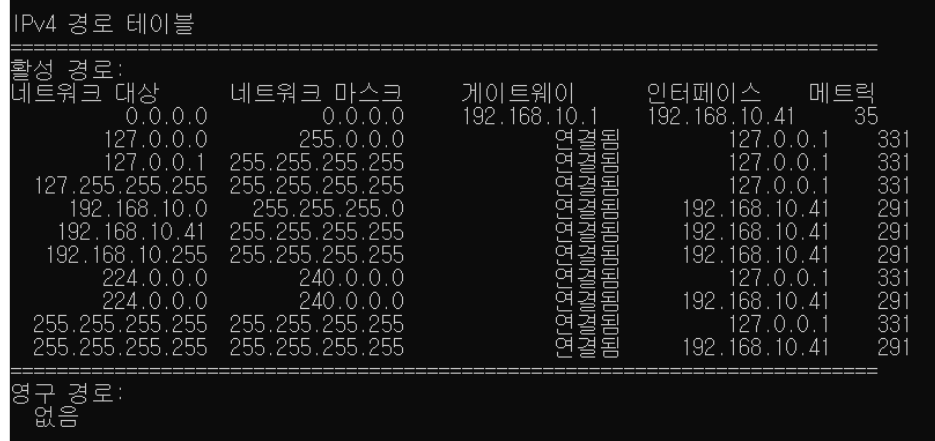
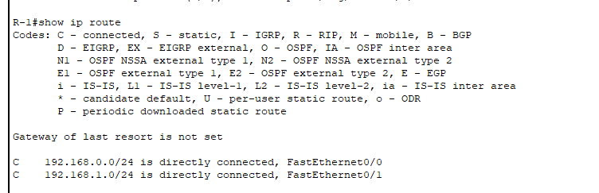
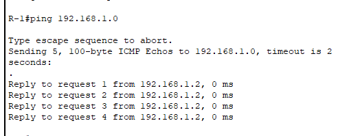

# 라우팅 테이블

[[라우터]]가 [[네트워크 토폴로지]]를 기록해둔 테이블. 이 테이블을 바탕으로 [[라우팅]] 작업을 해 [[라우팅 경로]]를 결정한다.

Cmd에서 route print 명령 실행시 라우팅 테이블을 볼 수 있다.

위 사진에서 '연결됨' 상태의 [[게이트웨이]]는 내가 속한 네트워크 내부에 연결된 다른 장비를 의미 한다. 위 경우 밖으로 나갈 때는 192.168.10.1의 게이트웨이가 필요하다. 
메트릭은 우선 순위이고 인터페이스는 네트워크의 [[랜카드]] 이다. 데이터를 내보낼 때는 게이트웨이의 랜카드 인터페이스를 통해 게이트웨이로 패킷을 내보내야 한다. - 메트릭을 선정하는 기준은 프로토콜마다 다르다. 트래픽, 거리 등 여러 기준이 있다.

## 작동의 실제 

바로 옆에 연결된, 즉 이웃한 기기의 라우팅 정보는 저절로 기록한다. 

시스코 라우터의 [[IOS]]에서 show ip route를 입력하면 라우팅 테이블을 확인할 수 있다. 인터페이스의(앞에 C가 붙는다, Connected; 최근 IOS 15에서는 로컬 경로를 L이라고 표기한다.)의 라우팅 경로가 나온다. 어떤 인터페이스에 어떤 장비가 연결되어 있는지 확인할 때 유용하다. 

인터페이스의 IP 주소로 핑을 보내면 해당 인터페이스로 연결된 건너편 장비가 응답을 해온다. 

## 정적 라우팅과 동적 라우팅

그러나 직접 연결되지 않은 모르는 네트워크는 어떻게 라우팅 하는가? 두 가지 방식이 있다. 
1. 정적 라우팅은 관리자가 수동으로 정적 경로를 추가하는 방법이다. - 프로토콜 작동이 없으므로 라우터의 성능이 좋아진다. 
2. 동적 라우팅은 라우터가 **자동으로** 최적 경로만 골라 라우팅 테이블에 경로를 추가한다. - **[[동적 라우팅 프로토콜]]**로 작동하며 리소스를 소모한다. RIP, IGRP, OSPF, IS-IS가 대표적이다. 

소규모 네트워크에서는 정적 라우팅으로 설정하면 유용하다. [[네트워크 토폴로지]]가 안정적이라면 굳이 리소스를 소모해 변화를 추적할 필요가 없다. 
대규모 네트워크의 설정에는 동적 라우팅이 적합하다. 자주 네트워크 토폴로지가 변형되기 때문.

현대의 네트워크는 대부분이 동적 라우팅을 사용하지만 소수의 정적 라우팅(ISP의 인터넷 연결 등 특수 네트워크)의 조합이다. 

## 정적 라우팅 설정

[[IOS]] 명령어로는 ip route 전역구성모드에서 [목적지 네트워크] [목적지 서브넷마스크] [경유지] [옵션] 

예시) ip route 10.0.0.0. 255.255.255.0 10.1.0.2 

경유지란? - 다음 장비(next hop)에 연결된 인터페이스의 IP 주소 또는 설정하고 있는 로컬장비의 인터페이스 이름으로 설정이 가능하다. 
    로컬 인터페이스를 경유지로 할 경우 [[AD]] 값은 0, next hop의 인터페이스의 IP 주소를 경유지로 할 때는 1로 설정한다. 
    여기서 AD는 프로토콜의 우선순위, 값이 낮을수록 우선순위가 높다. - AD가 있으면 라우팅 테이블에 최적경로(best path)가 여럿일 경우 높은 AD를 가진 경로를 택할 수 있다. 

옵션은 생략 가능하다.

[//begin]: # "Autogenerated link references for markdown compatibility"
[라우터]: 라우터.md "라우터"
[네트워크 토폴로지]: <네트워크 토폴로지.md> "네트워크 토폴로지"
[라우팅]: 라우팅.md "라우팅"
[라우팅 경로]: <라우팅 경로.md> "라우팅 경로"
[게이트웨이]: 게이트웨이.md "게이트웨이"
[IOS]: IOS.md "IOS"
[동적 라우팅 프로토콜]: <동적 라우팅 프로토콜.md> "동적 라우팅 프로토콜"
[//end]: # "Autogenerated link references"
[//begin]: # "Autogenerated link references for markdown compatibility"
[라우터]: 라우터.md "라우터"
[네트워크 토폴로지]: <네트워크 토폴로지.md> "네트워크 토폴로지"
[라우팅]: 라우팅.md "라우팅"
[라우팅 경로]: <라우팅 경로.md> "라우팅 경로"
[게이트웨이]: 게이트웨이.md "게이트웨이"
[IOS]: IOS.md "IOS"
[동적 라우팅 프로토콜]: <동적 라우팅 프로토콜.md> "동적 라우팅 프로토콜"
[네트워크 토폴로지]: <네트워크 토폴로지.md> "네트워크 토폴로지"
[IOS]: IOS.md "IOS"
[//end]: # "Autogenerated link references"