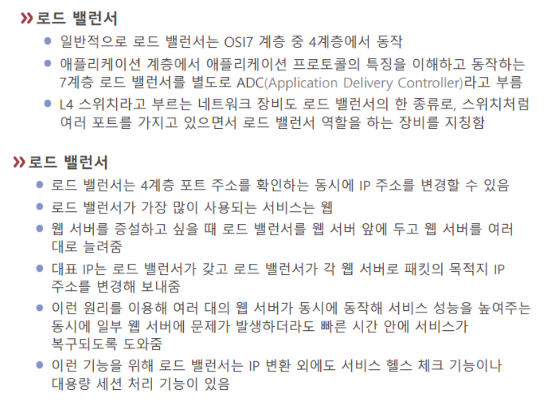

# 로드 밸런서

Load Balancer.

서버 여러 대나 네트워크에 [[트래픽]]을 분배하는 장치를 이른다. [[부하분산]]에 사용된다.

보통 로드밸런서보다 [[L4 스위치]]를 더 많이 쓴다.  

클라이언트는 기본적으로 로드밸런서의 [[IP 주소]]로 접속한다. 로드밸런서는 다시 서버의 아이피로 클라이언트를 연결시킨다. 여기서 IP 주소가 변경되기도 하는 것.  

[[AWS]]의 경우 로드 밸런서로 [[ELB]](Elastic Load Balancing)을 제공한다.

# 

[//begin]: # "Autogenerated link references for markdown compatibility"
[L4 스위치]: <L4 스위치.md> "L4 스위치"
[IP 주소]: <IP 주소.md> "IP 주소"
[AWS]: AWS.md "AWS"
[//end]: # "Autogenerated link references"