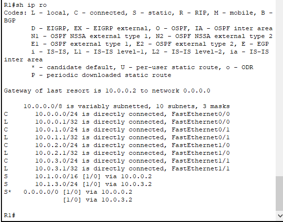
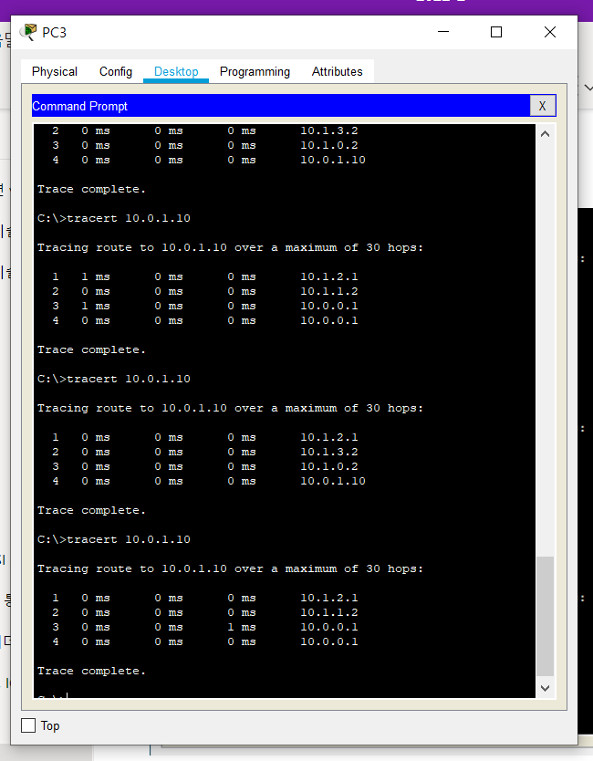

# 로드 밸런싱

네트워크에 [[트래픽]]을 분배해 [[부하분산]]을 하는 일. 패킷이 골고루 [[라우팅 경로]]를 이동하게 한다. 

[[IP 주소]]나 [[포트]]를 이용해 [[L3-네트워크]] 계층부터 설정이 가능하다. 

[[L4 스위치]]가 주로 맡는 역할이다. [[L3 스위치]]도 자주 맡는 편.

스위치나 공유기가 아니어도 어플리케이션도 로드 밸런싱을 할 수 있다. 

[[클라우드 컴퓨팅]]의 맥락에서는 가상 인스턴스 간의 로드 밸런싱이 핵심적이다. 
웹 서버, 웹 데이터베이스, 웹 어플리케이션에서 모두 로드 밸런싱을 활용한다. 

## 로드밸런싱 설정의 실제

시스코 라우터에서 로드 밸런싱을 설정한 모습. 한 IP 주소로 2개의 경유지가 있다. 다중 매핑.  

로드 밸런싱 설정 후에는 tracert를 여러 번 요청해 네트워크 트래픽이 변화하면 경로가 조금씩 달라진다.  

[//begin]: # "Autogenerated link references for markdown compatibility"
[라우팅 경로]: <라우팅 경로.md> "라우팅 경로"
[IP 주소]: <IP 주소.md> "IP 주소"
[포트]: 포트.md "포트"
[L3-네트워크]: L3-네트워크.md "L3-네트워크"
[L4 스위치]: <L4 스위치.md> "L4 스위치"
[L3 스위치]: <L3 스위치.md> "L3 스위치"
[클라우드 컴퓨팅]: <클라우드 컴퓨팅.md> "클라우드 컴퓨팅"
[//end]: # "Autogenerated link references"