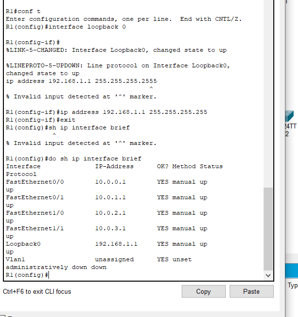

# 루프백 인터페이스

[[L2-데이터링크]] 계층 이상의 통신 장비는 [[가상화]] 한 논리적 인터페이스를 만들 수 있다. 이를 [[루프백 인터페이스]]라고 부른다. 

물리적 한계를 벗어나 작동하는 [[인터페이스]].

보통 스위치의 관리를 위해 [[IP 주소]]를 부여하거나 라우터에 가상의 IP 주소를 부여할 때 사용한다.

그외에도 패킷 소멸, 라우터에 라우터 id 부여에도 사용한다. 

다른 서브넷과 충돌하지 않도록 보통 [[서브넷 마스크]] /32를 부여하여 IP 주소를 구성한다. 

루프백으로 [[패킷]]을 보내면 일종의 패킷 블랙홀로 사용해 패킷을 소멸시킬 수 있다.

## [[IOS]]에서 루프백 구성 방법

전역구성모드에서, 
1. interface loopback 0 
2. ip address [IP 주소] [서브넷 마스크]

[//begin]: # "Autogenerated link references for markdown compatibility"
[L2-데이터링크]: L2-데이터링크.md "L2-데이터링크"
[루프백 인터페이스]: <루프백 인터페이스.md> "루프백 인터페이스"
[IP 주소]: <IP 주소.md> "IP 주소"
[패킷]: 패킷.md "패킷"
[IOS]: IOS.md "IOS"
[//end]: # "Autogenerated link references"
[//begin]: # "Autogenerated link references for markdown compatibility"
[L2-데이터링크]: L2-데이터링크.md "L2-데이터링크"
[루프백 인터페이스]: <루프백 인터페이스.md> "루프백 인터페이스"
[IP 주소]: <IP 주소.md> "IP 주소"
[패킷]: 패킷.md "패킷"
[IOS]: IOS.md "IOS"
[//end]: # "Autogenerated link references"