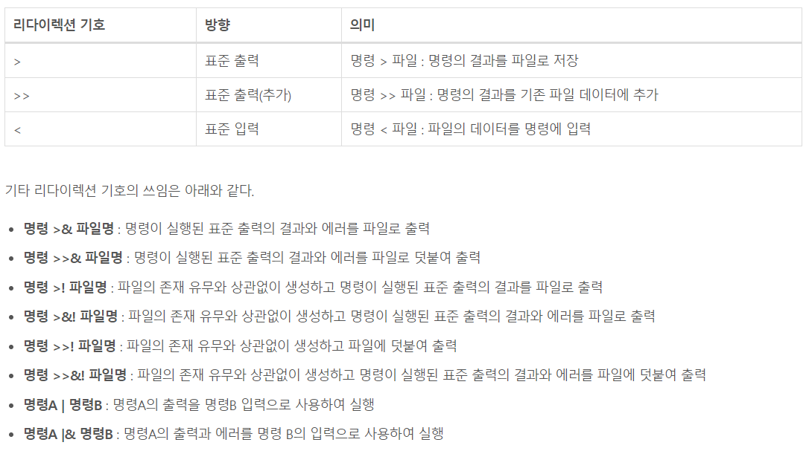

# 리디렉션

[[리눅스]] [[쉘]] 스크립트에서 꺽쇠 괄호(<, >)를 사용해 [[표준 입출력]]의 방향을 재정의 하는 일.

파일을 완전히 rewrite 해버리므로 조심해서 쓰자. 

표준 입력이나 출력 코드는 꺽쇠의 앞에 동작 방식을 미리 서술해주는 방식으로 순서를 잡는다. 
- 표준 입력 코드는 0,  
- 표준 출력 코드는 1, 
- 표준 에러 코드는 2 

표준 출력은 지금 보고 있는 터미널을 기본값으로 설정한다. 그러나 출력을 다른 사용자의 터미널로 할 수도 있다! 위 같은 기능을 응용하면 시스템의 중요한 정보를 한 계정으로 모을 수 있다.

없는 파일을 대상으로 표준 출력을 내보내면 새 파일이 생성된다. 

표준입력과 표준출력을 이해 하면 파일의 입력과 출력을 쉘 스크립트로 자동화해서 특정 파일에 출력하거나 입력하는 등의 여러 스크립트를 짤 수 있다.  

  
> 예제)
cat < aaa > aaa 명령어의 경우 생략된 코드를 넣으면 cat 0< aaa 1> aaa가 실행된다. aaa에 있던 내용을 cat에 표준 입력으로 넘기고 aaa에 cat이 가진 표준 출력을 집어 넣는다. 그러니까 change와 modify를 거쳐서 정확히 같은 파일이 된다.  

 

[//begin]: # "Autogenerated link references for markdown compatibility"
[리눅스]: 리눅스.md "리눅스"
[쉘]: 쉘.md "쉘"
[표준 입출력]: <표준 입출력.md> "표준 입출력(I/O)"
[//end]: # "Autogenerated link references"