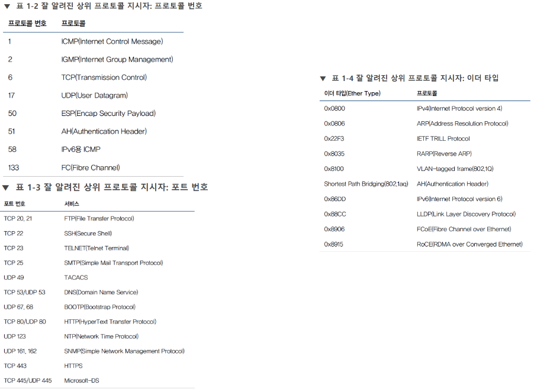

# 상위 프로토콜 지시자

모든 [[헤더]]에는 '[[상위 프로토콜 지시자]]'가 포함되어 있다. 예컨대 3계층의의 상위 프로토콜 지시자를 확인하면 어떤 [[프로토콜]]로 [[캡슐화]]되어 전송되었는지 확인 가능하다.

[//begin]: # "Autogenerated link references for markdown compatibility"
[헤더]: 헤더 "헤더"
[상위 프로토콜 지시자]: <상위 프로토콜 지시자> "상위 프로토콜 지시자"
[프로토콜]: 프로토콜 "프로토콜"
[캡슐화]: 캡슐화 "캡슐화"
[//end]: # "Autogenerated link references"