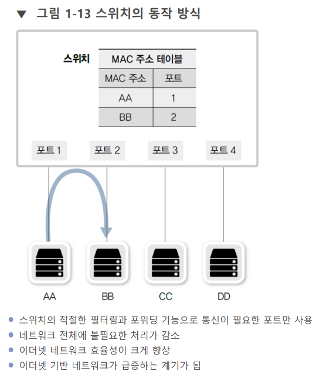

# 스위치

[[플로우 컨트롤]]을 담당하는 장비.

*허브와 비슷하지만*, 전기 신호의 단순 복제 이상으로 **[[MAC 주소]]를 통해 각각의 장비를 구별할 수 있다!** - [[플로우 컨트롤]]이 가능 

LAN 안에서 L2 스위치를 통한 통신을 [[스위칭]]이라고 한다.

[//begin]: # "Autogenerated link references for markdown compatibility"
[MAC 주소]: <MAC 주소> "MAC 주소"
[//end]: # "Autogenerated link references"