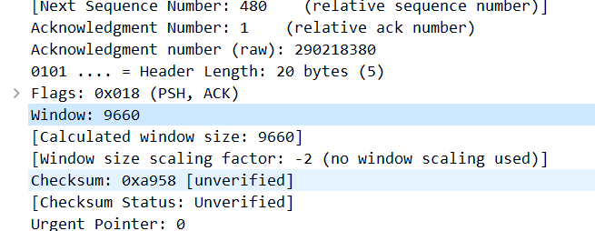

# 윈도 사이즈

윈도 사이즈가 9660이다. 

[[TCP]] 통신에서 상대와의 통신 속도를 제어하는 것을 [[플로우 컨트롤]]이라고 한다. 

여기서 윈도 사이즈는 플로우 컨트롤을 위한 단위로 한 번에 받을 수 있는 데이터의 크기로 송신자가 수신할 수 있는 [[버퍼]] 크기, 여유분과 관련 있다. 
    

## 참조
[[윈도 슬라이딩]]

[//begin]: # "Autogenerated link references for markdown compatibility"
[TCP]: TCP.md "TCP"
[플로우 컨트롤]: <플로우 컨트롤.md> "플로우 컨트롤"
[윈도 슬라이딩]: <윈도 슬라이딩.md> "윈도 슬라이딩"
[//end]: # "Autogenerated link references"