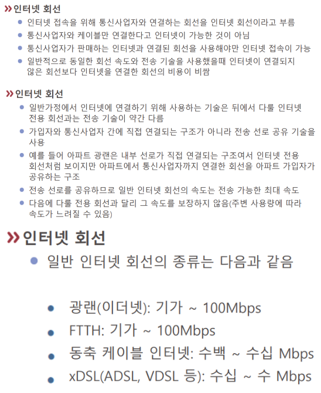

# 인터넷 회선

[[ISP]]와 연결되는 [[회선]]이다.
[[인터넷]]으로 연결되는 회선.

[//begin]: # "Autogenerated link references for markdown compatibility"
[ISP]: ISP.md "ISP"
[회선]: 회선.md "회선"
[인터넷]: 인터넷.md "인터넷"
[//end]: # "Autogenerated link references"