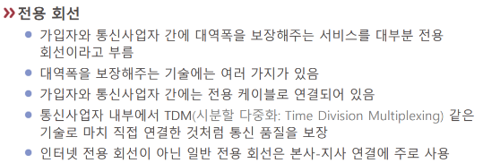

# 전용 회선
=Private Network

[[대역폭]] 보장이 핵심인 [[회선]]. [[보안]] 문제에도 유용하다. 

[[가상화]]하면 [[VPN]]이다.

[//begin]: # "Autogenerated link references for markdown compatibility"
[회선]: 회선.md "회선"
[가상화]: 가상화.md "가상화"
[VPN]: VPN.md "VPN"
[//end]: # "Autogenerated link references"