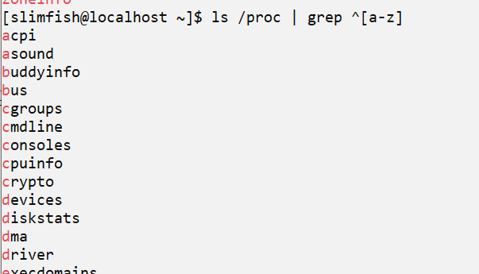

# 정규화 표현식

[a-z][A-Z]

## 예제

[[grep]]으로 소문자로 시작하는 파일 찾기
- ^는 제일 앞에 소문자를 포함하는가에 관한 구문이다. 

## 참조
- https://regex101.com
  - https://regex101.com/library?orderBy=MOST_POINTS&search=

[//begin]: # "Autogenerated link references for markdown compatibility"
[grep]: grep.md "grep"
[//end]: # "Autogenerated link references"