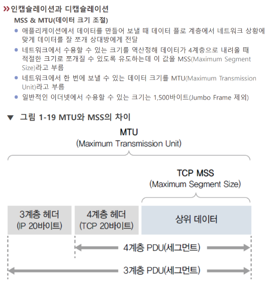

# 캡슐화

=캡슐레이션

[[패킷]]을 쪼개고 [[헤더]]를 부착하는 과정.

[[프로토콜]]이 정의한 [[MTU]]와 [[MSS]]에 따라 패킷을 쪼갠다.

[//begin]: # "Autogenerated link references for markdown compatibility"
[패킷]: 패킷 "패킷"
[헤더]: 헤더 "헤더"
[프로토콜]: 프로토콜 "프로토콜"
[MTU]: MTU "MTU"
[MSS]: MSS "MSS"
[//end]: # "Autogenerated link references"