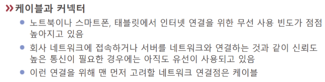
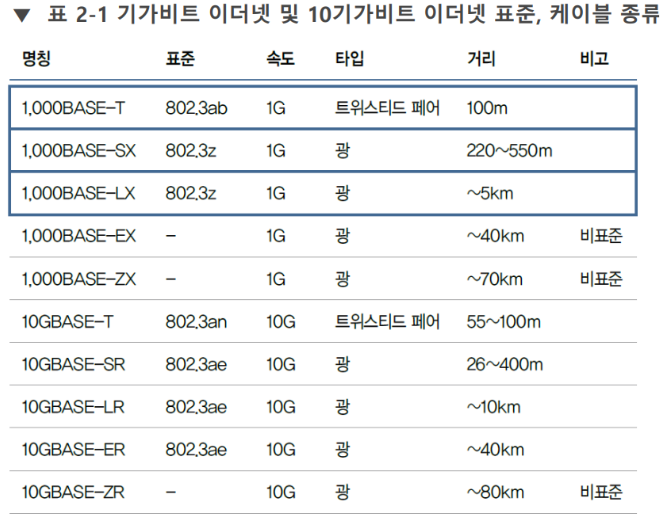
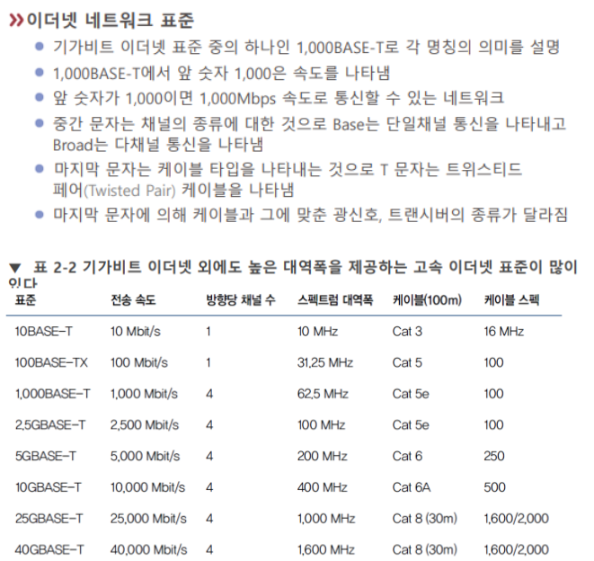

# 케이블과 커넥터

높은 [[신뢰성]]이 필요한 경우에는 유선 연결을 사용한다.   

수많은 케이블 중에 잘 선택하려면 전부 다 알기보다는 기본 요소와 [[표준]]을 알아야 한다.  
일반적으로 비쌀수록 신호의 지속력과 속도가 좋다 
실무에서는 광케이블은 비싸서 잘 안 쓰게 될 것.  

### 케이블 규격의 예

### [[이더넷]] 네트워크 표준과 케이블

실무에서는 표준 이름보다는 케이블의 종류, 예컨대 Cat 5e 등을 더 자주 거론한다. Cat 5e는 유효거리 100m 안에서 1기가바이트의 속도를 낼 수 있는 자주 사용되는 규격이다. 최근엔 짧은 거리에서는 Cat 6, 7, 8도 쓴다. 그러나 표준은 6까지다.  

[//begin]: # "Autogenerated link references for markdown compatibility"
[표준]: 표준 "표준"
[//end]: # "Autogenerated link references"