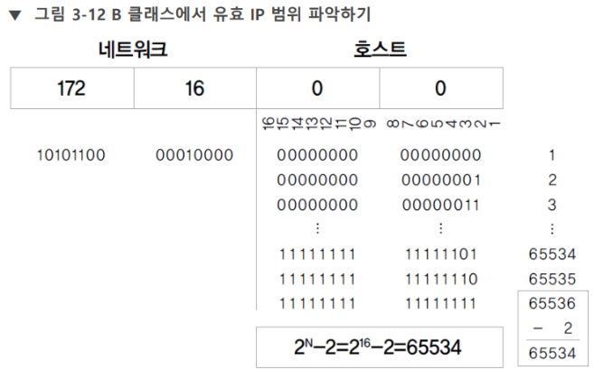

# 클래스풀 주소 체계와 클래스리스 주소 체계

## 클래스풀 주소 체계 

[[서브넷 마스크]]가 없던 시절의 주소 체계. 

IP 주소는 네트워크 주소 + 호스트 주소로 구성된다. 네트워크 주소가 같으면 같은 로컬 네트워크에 속한다.  

클래스풀 주소 체계에서는 클래스라는 개념을 사용해 [[IP 주소]]를 사용한다. 현대에는 클래스를 사용하지 않지만 클래스의 뼈대는 현대에도 남아 있다.  

클래스는 IP 주소를 효율적으로 배정하기 위한 개념이다.  43억개 IP 주소를 여러 국가와 기관, 개인에게 배분하기 위해 등장했다.  

클래스의 적용에는 수학적 계산을 동반한다. 43억개 IP 주소는 자의적으로 정한 5개 구간으로 나누었다. 나뉜 클래스에는 A, B, C, D, E 클래스라고 이름을 붙였다.  

 

 A 클래스 - 0.0.0.0~127.255.255.255.255(이진법으로 위 주소를 쓰면 0x8.0x8.0x8.0x8 ~ 01x7.1x8.1x8.1x8) 
B 클래스 - 128.0.0.0 ~191.255.255.255 
C 클래스 - 192.0.0.0 ~ 223.255.255.255 
D 클래스 - 224.0.0.0 ~ 239.255.255.255 
E 클래스 - 240.0.0.0. ~ 255.255.255.255 

위 체계에서는 맨 앞자리 숫자만 보면 클래스를 구분해 주소 구분자를 적용할 수 있었다.  

### [[서브넷 마스크]] 심화 

255.255.255.0 - 이진법으로 바꾸면 11111111.11111111.11111111.00000000 - 여기서 1로된 부분이 네트워크 주소, 0으로 된 부분이 호스트 주소이다. 

### 퀴즈 

192.168.0.10과 192.168.0.148이 있을 때 서브넷 마스크가 255.255.255.128이면 두 IP 주소는 같은 네트워크 인가? 

정석적 계산법: 대상 IP에 서브넷 마스크를 비트 연산(and 연산)해서 나온 계산결과가 같으면 같은 주소이다.  

192.168.0.10 -> 11000000.10101000.00000000.00001010  
192.168.0.148 -> 11000000.10101000.00000000.10010100 
255.255.255.128 -> 11111111.11111111.11111111.10000000 

And 연산 결과는 각각 
11000000.10101000.00000000.00000000 
11000000.10101000.00000000.10000000 
두 계산결과가 다르므로 같은 네트워크에 속하지 않는다. 

서브넷 마스크는 255.255.255.0를 매우 자주 쓰지만 그 설정만 있는 것이 아니므로 같은 네트워크에 속하는가에 관해 계산할 수 있어야 한다. 

실무에서는 더 단순한 재주를 많이 쓴다. 예컨대 2진수 체계를 고려해 서브넷 마스크의 경우의 수를 암기하면 암산하기 편하다.  

서브넷 마스크 당 네트워크 개수를 알아두는 것도 편리하다. 예를 들어 255.255.255.0은 1개 옥텟에서 0~255 –2 인 254개를 사용할 수 있다. 255.255.252.0의 경우 1024-2=1022개를 사용할 수 있다.  

### A 클래스 

0xxxxxxx.xxxxxxxx.xxxxxxxx.xxxxxxxx 

A 클래스는 이진법으로 표기하면 0으로 시작한다. 0이란 숫자로 A클래스임을 알아볼 수 있는 것.   
(이해의 편의를 위해) 일종의 서브넷마스크 주소가 255.0.0.0으로 지정된다고 생각할 수 있다.  

첫 옥텟이 네트워크 주소를 맡고 나머지 3개 옥텟이 호스트 주소를 맡는다.  

첫 옥탯의 숫자를 고려하면 A 클래스의 네트워크 개수는 128개이다. - 그러나 0과 127은 IP 주소로 사용하지 않기 때문에 126개가 실질적 네트워크 개수이다.  

그리고 나머지 옥텟의 경우의 수를ㄹ 고려하면 A클래스의 호스트 개수는 256*256*256으로 16777216(1600만)개이다. - 그러나 가장 처음(2진법으로 호스트 주소를 표현할 때 숫자가 모두 0인 주소, 해당 네트워크를 가리키는 주소)과 마지막 호스트 주소(2진법에서 숫자가 모두 1인 주소, 해당 로컬 네트워크의 브로드캐스트 주소, x.255.255.255)는 특정 목적에 할당되어 빼야 한다. 실질적으로 16777216-2개 호스트가 있다.   

즉, A 클래스는 126개 네트워크 각각에 16777214개 호스트가 있는 구조이다.  

### B 클래스 

10xxxxxx.xxxxxxxx.xxxxxxxx.xxxxxxxx 
일종의 서브넷마스크 주소가 255.255.0.0으로 지정된다고 생각할 수 있다.  

첫 두 개 옥텟에서 발생하는 네트워크 개수는 2^14=16384개이다.  
호스트 개수는 2^16=65536개로 특수목적 주소 2개를 제하면 65534개이다. 
B 클래스는 16384개 네트워크 각각에 65536개 호스트가 있는 구조이다.  
 

### C 클래스 

실제로 가장 많이 쓰는 주소 체계 
110xxxxx.xxxxxxxx.xxxxxxxx.xxxxxxxx 
일종의 서브넷마스크 주소가 255.255.255.0으로 지정된다고 생각할 수 있다.  
네트워크 수는 2^21=2097152개, 호스트 수는 2^8=256개이다.  
C 클래스는 2097152개 네트워크 각각에 254개 호스트가 있다. 

### D 클래스, E 클래스 

각각 멀티캐스트 주소와 예약용 클래스이다. 후자는 안 쓴다. 전자는 라우터가 244.0.0.0~ 의 주소에 멀티캐스트용 그룹의 주소를 지정할 때 쓴다.  

네트워크 주소, 브로드캐스트 주소, 실제 사용가능한 IP 주소 폭을 계산할 수 있어야 한다. #암기 

## 클래스리스 주소 체계 

 

CIDR가 1993년 등장한 후의 주소 체계. 사이더라고 읽는다.  

네트워크를 더 세밀하게 분할할 수 있다.  

 

여기서 [[서브넷 마스크]]가 정식으로 도입된다. 서브넷 마스크로 네트워크를 아주 세세히 나눌 수 있다.  

 

인터넷 상용화로 호스트 수가 폭증하면서 도입된 초기 대책.  

(두 번째 중기 대책은 [[NAT]]와 [[사설 IP 주소]], 세 번째 대책은 [[IPv6]]) 

 

 

# 사설 IP 주소 

일반적으로 로컬 네트워크 주소에서 IP 주소 설정은 자유롭지만 이 IP 주소는 사설 IP 주소이다 . [[공인 IP 주소]]는 [[ISP]]와 국가가 발급한다.  

 

### 핵심 개념들 

- 서브넷 마스크, 프리픽스 
- 서브네팅 - 네트워크 나누기 
- 슈퍼네팅 - 네트워크를 합치기  

프리픽스는 서브넷 마스크를 간편히 작성하게 해주는 기법이다. 이진법으로 작성한 서브넷마스크에서 1의 숫자를 [[IP 주소]] 뒤에 슬래시 후 작성하면 된다.  

예) 192.168.10.0 255.255.255.0 -> 192.168.10.0/24 

실무에서는 두 가지 표기법을 모두 사용한다.  

서브네팅은 [[서브넷 마스크]]를 사용해 네트워크를 쪼개는 것을 말한다. 이 기법을 사용하면 대역폭이 크게 분할된 네트워크를 쪼개서 IP를 절약할 수 있다. 2의 배수를 단위로 쪼개기가 이루어진다. 네트워크를 반복적으로 1/2로 분할하는 것이 서브네팅.  

참조 
- 서브넷 마스크와 서브넷팅 계산 방법 
- [[VLSM]] 

**효율적인 서브네팅을 하자!** 

### 퀴즈 1 - 서브넷 마스크를 프리픽스로  

255.0.0.0 -> /8 
255.255.255.0 -> /24 
255.255.255.224 -> /27  
255.255.248.0 -> /21 

 

### 퀴즈 2 – 211.100.10.0~211.100.10.255의 C 클래스 네트워크를 네트워크 당 60개의 IP를 사용 가능하도록 서브네팅 한다. 

1) 서브넷마스크는? 255.255.255.192 
2) 서브넷의 개수는? - 0~255(256개)가 64개씩으로 쪼개면 서브넷 수는 4개. 
3) 네트워크당 IP 수는? - 64개 
4) 첫번째 서브넷의 브로드캐스트 주소는? 211.100.10.63 
5) 두번째 서브넷의 사용가능한 IP 범위는? 211.100.10.65~211.100.10.126 

풀이 - 무조건 반으로 나눈다. C 클래스이므로 서브넷 마스크는 255.255.255.0이므로 마지막 옥텟에서 IP는 256개 경우가 발생 - 256을 반으로 쪼갠다=128 - 또 쪼갠다 128/2=64 - /24였던 프리픽스는 2로 쪼갤때마다 1씩 늘어난다. 최종 프리픽스는 /26 - 서브넷 마스크 표기법으로 바꾸면 255.255.255.192 

### 퀴즈 3 - 위 문제를 13개 IP를 전제로 풀기 

1) 서브넷 마스크 - 255.255.255.240, /28 (**3, 256부터 서브넷을 네 개로, 네 번 쪼개야 하므로 2^0+2^1+2^2+2^3=16를 255에서 뺀다, 프리픽스는 네 번 쪼갰으니 32-4(쪼갠 수)=28이다.) 
2) 서브넷 수 - 16개(**2, 네트워크당 IP 수를 정하고 나면 256을 IP 수(여기서는 16)로 나눈다, 256/16=16이므로 16개 서브넷.) 
3) 네트워크 당 IP 수 - 16개(**1, 13보다 큰 2의 배수로 잡는다) 
4) 첫번째 서브넷의 브로드캐스트 주소 - 211.100.10.15(서브넷 범위의 마지막 번호) 
5) 두번째 서브넷의 사용가능한 IP 범위 - 211.100.10.17~30(서브넷의 제일 앞 번호와 마지막 번호는 제외한다) 

 

### 퀴즈 4 - 심화 - B 클래스 크기의 네트워크를 서브네팅 한다. 네트워크 주소가 151.92.0.0인 B 클래스 네트워크를 각 네트워크 당 6500개의 IP가 사용가능하도록 서브네팅 하라  

1 - 네트워크당 IP가 6500개이려면 서브넷 당 최소 IP 수는 2^13=8192이어야  
2- B 클래스는 두 개 옥텟을 사용하므로 2^16=65536 크기일 것이다. 2^16/2^13 = 2^3 = 8이다. 그러므로 3번 쪼개며 서브넷 수는 8개다.  
3 - 프리픽스 표기법은 /19 (255.255.255.255이 /32, 255.255.255.0이 /24인 것을 감안해 IP수를 결정하는 데 썼던 13을 사용해 32-13=19.), 서브넷 마스크 표기법은 255-31(1+2+4+8+16)=224이므로 255.255.224.0 

[//begin]: # "Autogenerated link references for markdown compatibility"
[IP 주소]: <IP 주소.md> "IP 주소"
[NAT]: NAT.md "NAT"
[IPv6]: IPv6.md "IPv6"
[공인 IP 주소]: <공인 IP 주소.md> "공인 IP 주소"
[ISP]: ISP.md "ISP"
[IP 주소]: <IP 주소.md> "IP 주소"
[VLSM]: VLSM.md "VLSM"
[//end]: # "Autogenerated link references"
