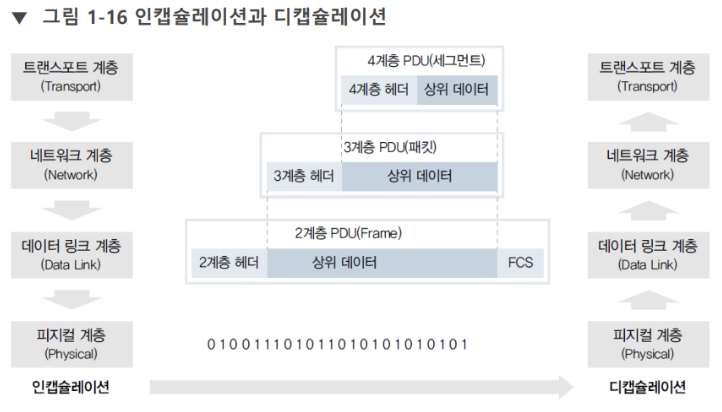

# 패킷 통신

[[플로우 컨트롤]]의 전제조건.

[[캡슐화]]와 [[역캡슐화]] 과정이기도 하다. 
(프레임, 패킷, 세그먼트는 #암기 할 것)

패킷통신에서 엔드포인트는 양쪽이다. PC와 서버 양쪽이 엔드포인트. 
그리고 서버는 다시 프론트엔드-백엔드-DB로 개념적 분할이 가능하다. 

PC에서 서버에 접속하려면 어플리케이션 프로그램이 필요하다. 이 프로그램이 먼저 통신할 서버에 보낼 데이터를 만든다. 그런데 이 데이터는 너무 크다. 그러므로 7계층에서 데이터를 잘게 쪼개는데 이렇게 쪼갠 것이 [[패킷]]이다. 파일전송일 경우 FTP, 메일이면 SMTP로, 웹 통신이면 HTTP로 데이터를 쪼갠다.  

7계층에서 쪼갠 데이터는 4계층의 TCP 혹은 UDP로 보내 TCP 헤더를 붙인다. 바디 앞에 붙는 헤더는 메타정보를 담는다. 편지가 바디라면 편지봉투에 적는 정보가 메타정보이다.  
위 형태로 헤더를 붙이는 작업을 [[캡슐화]] (encapsulation)라고 한다. - 7계층에서 만들어진 [[PDU]]는 '데이터',  4계층의 PDU는 '[[세그먼트]]'라고 한다.  

다시 2계층으로 오면 이더넷 헤더와 꼬리가 양쪽에 붙는다. 2계층에 오면 PDU가 '[[프레임]]'이 된다.  

1계층에서는 [[전기 신호]]가 된다. 이 단위를 비트라고 말한다. 1계층 맥락에서는 PDU라는 개념이 성립하지 않는다. 의미론이 작동하는 데이터가 아니라 전기 신호이기 때문이다.  

전기신호로 바뀐 [[프레임]]은 공유기, 스위치, 라우터 등 네트워크 장비를 거쳐 최종 목적지까지 간다.  

목적지가 다른 네트워크일 경우 IP 주소를 보고 [[게이트웨이]]로 신호를 내보낸다. 게이트웨이로 신호를 내보내려면 3계층에서는 공유기의 공인 IP주소를, 2계층에서는 MAC 주소를 작성한다.  

게이트웨이로 나간 신호는 2계층에서 [[MAC 주소]]를 식별하고 출발지와 목적지를 확인한다.  

3계층에서 (라우터는 3계층 장비이므로 1, 2, 3계층을 볼 수 있다.) 라우터는 출발지와 목적지를 보고 [[라우팅 테이블]]을 참조해 [[라우팅 경로]]를 설정한다. [[라우팅]] 과정에서 2계층과 3계층의 헤더는 계속 바뀐다. 헤더가 계속 바뀌면서 MAC 주소를 변경하고 신호를 다음 장비로 전송하는 과정이 반복된다.  

한편 상위 계층의 장비를 지나가다 보면 IP나 포트가 입력된 헤더가 바뀌기도 한다.  

(2, 3, 4, 7 계층을 다 이해할 수 있는 장비의 조사를 dpi라고 부른다.) 

# 

### 중간정리
2계층은 전기 신호를 의미론적 단위로 변환한다.  
3계층은 라우팅 한다. 
4계층에서는 포트를 구분한다.  
7계층은 스팸메일 검사, 악성 코드 검사까지 할 수 있다. 

 # 

디캡슐레이션(decapsulation)[[역캡슐화]]은 목적지에 도착해서 캡슐을 해제하는 과정. 이 과정에서는 헤더가 하나씩 떨어져 나간다.  

1계층에서 전기신호를 받아서 2계층으로 올리면 해당 데이터는 의미 있는 '프레임'이 된다.  

2계층에서는 꼬리 부분을 확인해 오류를 체크한다. 그리고 MAC 주소를 체크해 자신에게 온 패킷이 맞는지 확인하고 맞을 경우 3계층으로 통과시킨다. 

3계층에서는 IP 주소를 확인하고 4계층으로 통과시킨다. 

4계층에서는 포트를 체크해서 해당 포트에서 작동하는 프로세스에게 해당 데이터를 보낸다.  

프로세스는 패킷으로 쪼개진 데이터를 모아서 필요한 데이터가 모이면 연산을 진행시킨다.

[//begin]: # "Autogenerated link references for markdown compatibility"
[플로우 컨트롤]: <플로우 컨트롤.md> "플로우 컨트롤"
[캡슐화]: 캡슐화.md "캡슐화"
[역캡슐화]: 역캡슐화.md "역캡슐화"
[패킷]: 패킷.md "패킷"
[PDU]: PDU.md "PDU"
[전기 신호]: <전기 신호.md> "전기 신호"
[게이트웨이]: 게이트웨이.md "게이트웨이"
[MAC 주소]: <MAC 주소.md> "MAC 주소"
[라우팅 테이블]: <라우팅 테이블.md> "라우팅 테이블"
[라우팅 경로]: <라우팅 경로.md> "라우팅 경로"
[라우팅]: 라우팅.md "라우팅"
[//end]: # "Autogenerated link references"
[//begin]: # "Autogenerated link references for markdown compatibility"
[플로우 컨트롤]: <플로우 컨트롤.md> "플로우 컨트롤"
[캡슐화]: 캡슐화.md "캡슐화"
[역캡슐화]: 역캡슐화.md "역캡슐화"
[패킷]: 패킷.md "패킷"
[캡슐화]: 캡슐화.md "캡슐화"
[PDU]: PDU.md "PDU"
[전기 신호]: <전기 신호.md> "전기 신호"
[게이트웨이]: 게이트웨이.md "게이트웨이"
[MAC 주소]: <MAC 주소.md> "MAC 주소"
[라우팅 테이블]: <라우팅 테이블.md> "라우팅 테이블"
[라우팅 경로]: <라우팅 경로.md> "라우팅 경로"
[라우팅]: 라우팅.md "라우팅"
[역캡슐화]: 역캡슐화.md "역캡슐화"
[//end]: # "Autogenerated link references"