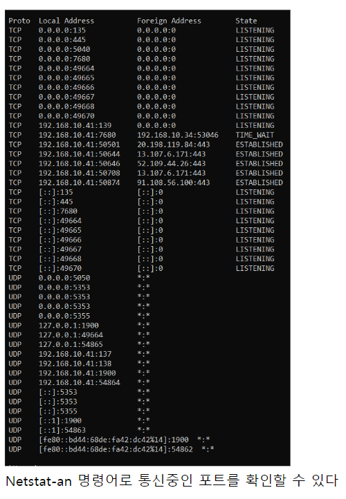

# 포트

[[L4-트랜스포트]] 계층에서 [[통신 프로세스]]의 주소가 포트이다. 

포트는 [[프로세스]]의 통신 주소이다. (엄밀하게 그렇지는 않지만.) 동일한 IP 주소를 가진 시스템 내에서 각각의 프로세스에 정확한 통신 데이터를 전달하기 위해서 사용한다. 컴퓨터 하나당 여러 프로세스가 작동하므로 포트도 여럿이 있다.  

모든 어플리케이션은 포트를 가지고 있다. 인터넷을 할 수 있는 웹브라우저 같은 [[통신 프로세스]]가 다른 통신 프로세스와 연결되면 통신이 이루어지는 것이다. 

- 0-65535(2의 16승 크기)개 주소를 사용하며 16비트 포맷의 주소를 사용한다. 
- 0-1023: [[시스템 포트]] 혹은 Well-known 포트 - 잘 알려진 서비스들이 사용 - 예) 웹서비스는 80, 주로 서버에서 사용 - http는 80, https는 443 포트를 사용한다.  
- 1024-49151: [[유저 포트]] 혹은 registered 포트 - 응용 프로그램들, 클라이언트가 자주 사용 
- 49152-65535: [[다이나믹 포트]] - 클라이언트 쪽에서 접속 용도로 자주 사용 

포트는 한 번 연결되면 해당 프로세스가 사용중인 동안 같은 포트를 계속 사용한다. 어떤 프로세스가 해당 포트를 점유하고 있으면 다른 프로세스는 그 포트를 사용할 수 없다. 포트 하나 당 프로세스 하나가 법칙이다.  

## 많이 알려진 서비스의 포트 번호  

#암기
(TCP 프로토콜 위에서 작동-신뢰가 필요한 경우) 
- [[FTP]]: 21, 20**** 
- [[SSH]]: 22****
- TELNET[[텔넷]]: 23** 
- SMTP: 25 
- [[HTTP]]***: 80 - 웹 시대의 필수 프로토콜 
- POP3: 110 - 이 프로토콜로 받으면 메일서버에서 메일이 지워진다 
- IMAP: 143 
- [[HTTPS]]: 443 – 원래는 [[SSL]] 프로토콜로 암호화 통신을 하는 포트. 그러나 대부분이 HTTPS 프로토콜이 이루어진다.**** 
- SMB: 445- 프린터, 파일 공유(개발자들이 많이 쓴다) 

(데이터베이스 3대장)**** 
- MSSQL: 1433, 1434 
- MYSQL: 3306 
- ORACLE: 1521 

- 원격데스크톱: 3389 

 
(UDP 프로토콜 사용) 
- [[DNS]]: 53 - 무난하게 설정할 DNS 서버 주소는 구글 것: 8.8.8.8 - *통신은 되는데 URL 접속만 문제이면 DNS 서버 설정에서 문제가 생긴 것 - 주로 UDP 53번*** 
- [[TFTP]]: 69 - 간소화 시키고 로그인이 없는 FTP 
- Netbios: 137-139 - 윈도 통신 관련 서비스(TCP와 UDP 혼합해 사용) 
- [[SNMP]]: 161, 162 - 관리 시스템에서 프린터, 서버, 네트워크 장비 등 장비를 관리할 때 쓴다. 각 장치의 장비정보를 받거나 설정을 바꾼다. - 주로 프린터와 복합기
- [[DHCP]]: 67**** 

 
## 각 포트에 해당되는 서비스 확인 

유닉스와 리눅스 경우 /etc/services 

윈도 windows\system32\drivers\etc\services 

[//begin]: # "Autogenerated link references for markdown compatibility"
[L4-트랜스포트]: L4-트랜스포트.md "L4-트랜스포트"
[통신 프로세스]: <통신 프로세스.md> "통신 프로세스"
[프로세스]: 프로세스.md "프로세스"
[통신 프로세스]: <통신 프로세스.md> "통신 프로세스"
[SSH]: SSH.md "SSH(Secure Shell)"
[HTTP]: HTTP.md "HTTP"
[HTTPS]: HTTPS.md "HTTPS"
[SSL]: SSL.md "SSL(Secure Sockets Layer)"
[DHCP]: DHCP.md "DHCP"
[//end]: # "Autogenerated link references"