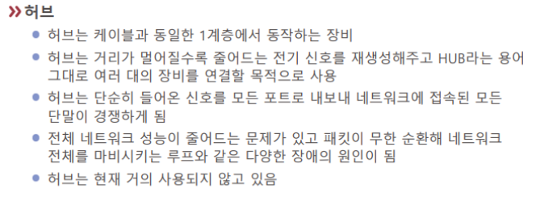

# 허브

[[L1-물리]] 계층의 장비.

[[스위치]]와 자주 합쳐져 있다. 

[//begin]: # "Autogenerated link references for markdown compatibility"
[L1-물리]: L1-물리 "L1-물리"
[스위치]: 스위치 "스위치"
[//end]: # "Autogenerated link references"