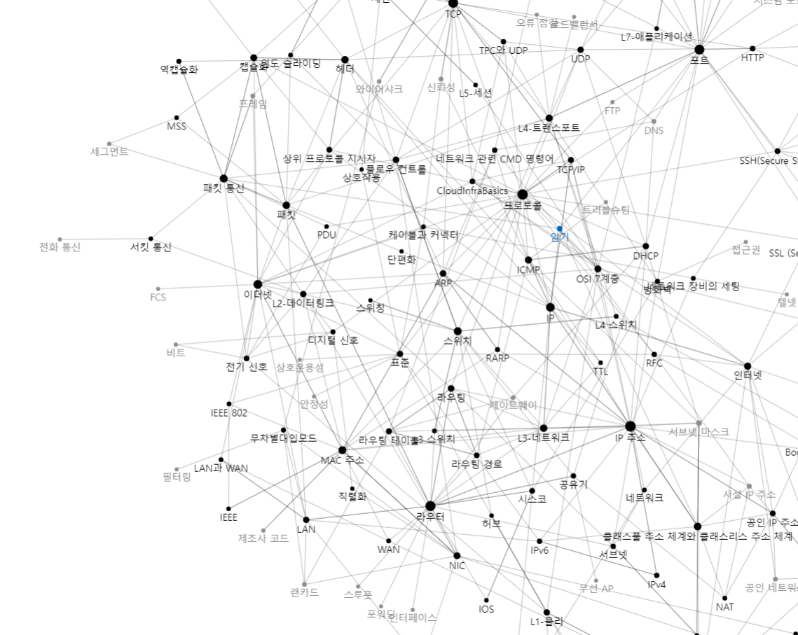

# 220920 일지

#일지

오늘은 [[ARP]], [[ICMP]], 

그리고 [[CISCO 패킷 트레이서]]에서 [[IOS]]를 사용한 라우터, 스위치 설정과 트러블 슈팅을 실습했다. 

점점 더 네트워크의 흐름에 대해서 이해가 잘 되는 것 같다. 
특히 IP와 TCP가 어떻게 묶여서 자주 이야기되는가를 확실히 이해할 수 있었다.
3계층에서 IP가 라우팅을 주 기능으로 작동하면 TCP가 패킷화하는 흐름. 

[//begin]: # "Autogenerated link references for markdown compatibility"
[ARP]: ../docs/ARP.md "ARP"
[ICMP]: ../docs/ICMP.md "ICMP"
[CISCO 패킷 트레이서]: <../docs/CISCO 패킷 트레이서.md> "CISCO 패킷 트레이서"
[IOS]: ../docs/IOS.md "IOS"
[//end]: # "Autogenerated link references"